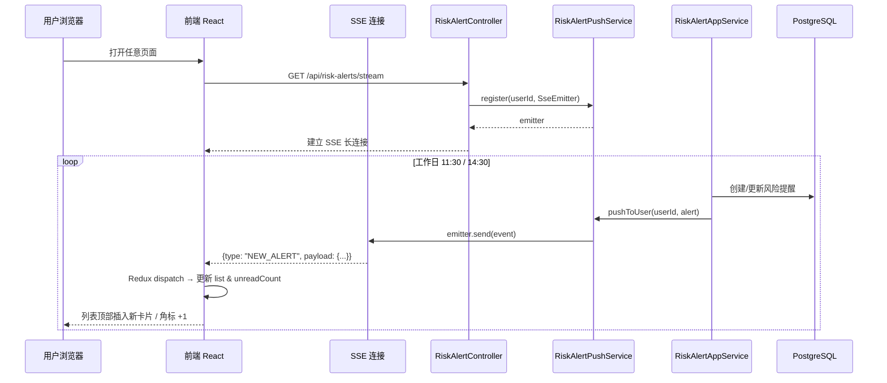

# 实时风险提醒推送需求文档（PRD）

## 1. 背景与问题

当前系统的风险提醒数据仅在**工作日 11:30 和 14:30** 由后端定时任务生成，但前端页面和导航栏未读角标只在**用户手动刷新或重新打开页面时**才能获取到最新数据。这导致：

- 用户在系统停留期间，无法感知新产生的风险提醒。
- 导航栏铃铛数字滞后，用户可能错过重要风险通知。
- 用户必须手动刷新风险提醒列表页面才能看到新数据。

## 2. 目标

实现风险提醒的**准实时推送**，在后台生成新的风险提醒后，前端能够在**数秒内**自动更新：

1. 导航栏未读角标自动 `+N`。
2. 若用户当前停留在风险提醒列表页，新数据自动插入列表顶部。
3. 保持现有分页、已读/未读等业务逻辑不变。

## 3. 技术方案选型

### 3.1 方案对比

| 方案 | 实时性 | 复杂度 | 资源消耗 | 适用性 |
|------|--------|--------|----------|--------|
| 短轮询（Polling） | 低（依赖间隔） | 低 | 高（无效请求多） | ❌ 不推荐 |
| 长轮询（Long Polling） | 中 | 中 | 较高 | ❌ 不推荐 |
| **SSE（Server-Sent Events）** | **高** | **低** | **低** | **✅ 推荐** |
| WebSocket | 高 | 高 | 低 | ⚠️ 过度设计 |

### 3.2 推荐方案：SSE（Server-Sent Events）

**理由**：

- **单向推送**：风险提醒是典型的服务器→客户端单向场景，SSE 天然匹配。
- **协议简单**：基于 HTTP，Spring Boot 原生支持 `SseEmitter`，前端原生支持 `EventSource`。
- **自动重连**：浏览器 `EventSource` 在连接断开后会自动重连，无需额外编码。
- **零新增依赖**：项目已有 `spring-boot-starter-web`，无需引入 WebSocket 或消息队列客户端。
- **穿透性好**：基于标准 HTTP，易于穿过防火墙和反向代理（Nginx 等）。

### 3.3 多端多标签页推送设计

同一用户可能在**多个浏览器标签页**或**多个设备**同时打开系统，推送需满足：

- **每个标签页独立接收**：用户打开 3 个标签页，3 个标签页的角标同时更新。
- **每个设备独立接收**：用户同时在电脑和手机登录，两端同时收到推送。
- **已读状态多端同步**：用户在 A 标签页点击"全部已读"，B 标签页和手机的角标立即清零。

**后端连接模型**：

```
Map<Long, List<SseEmitter>> userEmitters

例：
userId=1 → [Emitter-tab-1, Emitter-tab-2, Emitter-phone-1]
userId=2 → [Emitter-tab-3]
```

推送时按 `userId` 广播，遍历该用户的所有活跃连接逐一发送。单个连接失败（如标签页已关闭）不影响其他连接。

### 3.4 扩展预留

当前按**单机内存管理 SseEmitter**实现，但接口层预留**多实例广播**扩展能力：

```
阶段 1（当前）：单机内存推送
  RiskAlertPushService 使用 ConcurrentHashMap<Long, CopyOnWriteArrayList<SseEmitter>> 管理用户连接。

阶段 2（未来多实例）：引入 Kafka 广播
  - RiskAlertAppService 创建风险提醒后，发送 Kafka Topic `risk-alert-created`。
  - 各实例的 Consumer 接收消息，调用本地 RiskAlertPushService 推送给本实例持有的连接。
```

## 4. 业务规则

### 4.1 触发推送的时机

#### 逐条推送（创建或更新风险提醒时）

在 `RiskAlertAppServiceImpl.createOrUpdateRiskAlert()` 方法中，每次成功保存或更新记录后，立即触发 SSE 推送。具体规则：

| 操作类型 | `new_alert` 事件 | `unread_count_change` 事件 | 说明 |
|---|---|---|---|
| **新建记录** | ✅ 推送完整提醒数据 | ✅ `unreadCount` +1 | 首次触发该标的 |
| **更新已有记录** | ❌ 不推送 | ✅ `unreadCount` 根据数据库重新计算后推送 | 14:30 覆盖 11:30 的同标的记录，`isRead` 重置为 `false`，未读计数变化 |

**触发来源**：

- `RiskAlertScheduler` 在 11:30 / 14:30 执行 `checkAndCreateRiskAlerts()` 时，遍历所有订阅逐条处理。
- 管理员/测试人员手动调用 `POST /api/risk-alerts/check` 时。
- 后续可能扩展的批量创建接口。

#### 已读状态多端同步

- 用户在任意标签页/设备调用 `POST /api/risk-alerts/user/{userId}/mark-read` 标记全部已读后：
  - 数据库状态更新。
  - 后端通过 SSE 向该用户的**所有活跃连接**广播 `unread_count_change` 事件（`unreadCount: 0`）。
  - 所有打开的标签页/设备角标同步清零，无需刷新。

**不推送 `new_alert` 的场景**：

- 已有风险提醒被更新（如 14:30 覆盖了 11:30 的同标的记录）—— 此时 `isRead` 重置为 `false`，未读计数可能变化，因此**仍推送 `unread_count_change`**，但**不推送 `new_alert`**（列表中该条目已存在，前端通过收到 `unread_count_change` 后自行刷新列表即可）。

#### 风险解除推送（Risk Cleared）

当订阅的基金/股票**不再满足风险条件**时（如跌幅从 -2% 恢复到 -0.6%），后端会检测到这个"风险解除"场景：

| 操作类型 | `risk_cleared` 事件 | `unread_count_change` 事件 | 说明 |
|---|---|---|---|
| **风险解除** | ✅ 推送解除信息 | ✅ `unreadCount` -1，`reason: "RISK_CLEARED"` | 之前有风险，现在恢复正常，风险提醒从列表移除 |

**检测逻辑**：
- 在 `RiskAlertAppServiceImpl.processSubscriptionRisk()` 中，当处理某个订阅时：
  - 如果该订阅**之前有风险提醒记录**（数据库中 `is_read = false` 的记录）
  - 且**当前行情不再满足风险条件**（涨跌幅恢复到安全范围）
  - 则判定为"风险解除"
- 风险解除后：
  1. 删除数据库中该订阅的风险提醒记录
  2. 推送 `risk_cleared` SSE 事件给前端
  3. 前端收到后从列表中移除该提醒，并减少未读计数

**前端行为**：
- 收到 `risk_cleared` 事件后：
  - 从风险提醒列表中移除对应的提醒项（通过 `symbol` + `symbolType` + `date` 匹配）
  - 未读计数 -1
  - 不主动弹出提示（用户可通过列表变化感知）

### 4.2 推送内容

每次推送包含：

- `type`: `NEW_ALERT`（新提醒）或 `UNREAD_COUNT_CHANGE`（未读数变化）
- `payload`: 完整的风险提醒摘要对象或未读数量
- `timestamp`: 推送时间戳

### 4.3 前端行为

| 用户所在页面 | 收到推送后的行为 |
|-------------|----------------|
| **风险提醒列表页** | 新提醒数据 `prepend` 到列表顶部；若列表为空则替换 Empty 状态；未读角标 `+1`。 |
| **其他页面** | 仅导航栏未读角标 `+1`；不主动跳转。 |
| **页面处于后台（hidden）** | 角标更新；页面切回前台时，若在当前页可触发一次静默刷新。 |

## 5. 系统架构

### 5.1 整体流程



### 5.2 后端组件

```
backend/
├── application/service/riskalert/
│   ├── RiskAlertAppService.java              ← 现有：创建风险提醒后发布事件
│   └── impl/RiskAlertAppServiceImpl.java     ← ✅ 已修改：createOrUpdate 后发送事件
├── application/service/riskalert/push/
│   ├── RiskAlertPushService.java             ← ✅ 已新增：推送服务接口
│   └── impl/InMemoryRiskAlertPushService.java ← ✅ 已新增：单机内存实现
├── application/event/
│   └── RiskAlertCreatedEvent.java            ← ❌ 未实现：采用直接调用 pushService 替代 Spring Event
├── interfaces/controller/riskalert/
│   └── RiskAlertSSEController.java           ← ✅ 已新增：SSE 端点
└── config/
    └── SSEConfig.java                        ← ❌ 未独立创建：超时配置在 Controller 中直接完成
```

**说明**：
- `RiskAlertCreatedEvent` 未创建，采用**直接调用** `RiskAlertPushService` 方式实现推送，简化了事件传播链路。
- `SSEConfig` 未独立创建，连接超时配置在 `RiskAlertSSEController` 中完成。

### 5.3 前端组件

```
app/
├── services/
│   └── sse/
│       └── riskAlertSSE.ts                  ← ✅ 已新增：EventSource 封装
├── store/slices/
│   └── riskAlertsSlice.ts                   ← ✅ 已修改：新增实时接收 reducer
├── hooks/
│   └── useRiskAlertSSE.ts                   ← ✅ 已新增：SSE 连接生命周期 Hook
└── components/layout/
    └── Header.tsx                             ← ✅ 已修改：角标自动响应
```

## 6. 非功能需求

### 6.1 性能

- SSE 连接超时：默认 30 分钟（Spring SseEmitter 默认无超时，建议配置）。
- 心跳机制：每 30 秒发送一次 `ping` 事件，防止 Nginx/防火墙切断空闲连接。
- 单用户可维持 **多条** SSE 连接（多标签页/多端），后端使用 `CopyOnWriteArrayList<SseEmitter>` 管理，避免并发修改异常。
- 推送为异步操作，不阻塞风险提醒入库事务。
- 连接清理：SseEmitter 的 `onCompletion` / `onTimeout` / `onError` 回调中自动从用户连接列表移除。

### 6.2 可靠性

- 连接断开时，前端应在 3 秒内自动重连（EventSource 原生支持）。
- 后端维护连接时考虑异常隔离：单个用户推送失败不影响其他用户。
- 若推送失败（用户已离线），数据仍保留在数据库中，用户下次刷新页面可正常获取。

### 6.3 安全

- SSE 端点需校验用户身份（当前使用 `localStorage` 中的 `userId`，后续接入 JWT 时应从 Token 解析）。
- 用户只能订阅属于自己的推送流（按 `userId` 隔离）。
- 需配置 CORS，仅允许同源或指定域名访问 SSE 端点。

## 7. 兼容性影响

| 范围 | 影响 | 处理方案 |
|------|------|----------|
| 现有 REST API | 无影响 | 完全兼容，仅新增 SSE 端点 |
| 数据库表结构 | 无影响 | 不修改表结构 |
| 前端 Redux Store | 小影响 | `riskAlertsSlice` 新增 reducer 处理实时数据 |
| 依赖 | 无新增 | 利用现有 `spring-boot-starter-web` |
| 多实例部署 | 预留扩展 | 阶段 2 引入 Kafka 广播 |

## 8. 验收标准（AC）

### 8.1 基础连接

| 编号 | 验收标准 | 优先级 | 实现状态 | 测试方式 |
|------|----------|--------|----------|----------|
| **AC-1** | 用户打开页面后，浏览器 Network 面板可见 `/api/risk-alerts/stream` 请求，Response Headers 包含 `Content-Type: text/event-stream`，状态持续为 `200 pending`。 | P0 | ✅ 已实现 | 手工 + E2E |
| **AC-1-1** | SSE 建立后，服务端在 1 秒内推送 `init` 事件，前端 `unreadCount` 与数据库当前未读数一致。 | P0 | ✅ 已实现 | E2E |
| **AC-1-2** | 服务端每 30 秒发送一次 `ping` 事件，浏览器持续接收且无超时断开。 | P1 | ✅ 已实现（`SSEHeartbeatScheduler`） | 手工观察 |

### 8.2 数据推送（新风险提醒）

| 编号 | 验收标准 | 优先级 | 实现状态 | 测试方式 |
|------|----------|--------|----------|----------|
| **AC-2** | 手动触发风险检测（`POST /api/risk-alerts/check`）后，导航栏铃铛数字在 **3 秒内**自动增加。 | P0 | ✅ 已实现 | E2E |
| **AC-2-1** | 工作日 11:30 / 14:30 定时任务触发风险检测后，已登录用户无需任何操作，角标在 **10 秒内**自动增加。 | P0 | ✅ 已实现 | 手工（需等待定时任务）或 mock 时间 |
| **AC-3** | 用户停留在风险提醒列表页时，新产生的风险提醒自动出现在列表**最顶部**，且列表原有数据顺序不变。 | P0 | ✅ 已实现（通过 `syncNewAlert` reducer） | E2E |
| **AC-3-1** | 同一标的在同一日多次触发（如 11:30 和 14:30），列表中**不重复插入**，而是更新现有条目（时间、涨跌幅、触发次数）。 | P1 | ✅ 已实现（update 时不推送 new_alert） | E2E |
| **AC-3-2** | 新推送提醒的 `isRead` 初始为 `false`，列表中该卡片有"未读"视觉标识（如红点或背景色）。 | P1 | ✅ 已实现 | E2E |

### 8.3 多端/多标签页同步

| 编号 | 验收标准 | 优先级 | 实现状态 | 测试方式 |
|------|----------|--------|----------|----------|
| **AC-5** | 同一用户打开 3 个标签页，触发风险检测后，3 个标签页的铃铛数字均在 **3 秒内**同步增加。 | P0 | ✅ 已实现（`CopyOnWriteArrayList` 管理多连接） | E2E |
| **AC-5-1** | 用户在标签页 A 点击"全部已读"后，标签页 B 和标签页 C 的铃铛数字在 **3 秒内**同步清零，且列表中所有卡片的未读标识消失。 | P0 | ✅ 已实现（`pushMarkAllRead`） | E2E |
| **AC-5-2** | 用户在标签页 A 删除某条风险提醒后，标签页 B 的列表中该条提醒同步消失。 | P1 | ❌ 未实现（当前不支持删除） | E2E |

### 8.4 稳定性与可靠性

| 编号 | 验收标准 | 优先级 | 实现状态 | 测试方式 |
|------|----------|--------|----------|----------|
| **AC-4** | 前端网络断开（如关闭 WiFi）5 秒后恢复，EventSource 在 **5 秒内**自动重连并继续接收后续推送。 | P0 | ✅ 已实现（`scheduleReconnect`） | 手工 |
| **AC-4-1** | 后端服务重启后，前端在 **10 秒内**自动重连成功，并收到新的 `init` 事件。 | P1 | ✅ 已实现 | 手工 |
| **AC-6** | 非交易时段无风险提醒产生时，SSE 连接保持至少 30 分钟不被中间件（Nginx/防火墙）切断。 | P1 | ✅ 已实现（心跳保活） | 手工观察 |
| **AC-6-1** | 单个用户连接异常（如强制关闭浏览器）后，后端在 **2 分钟内**完成连接清理，该用户连接数正确减少。 | P1 | ✅ 已实现（`onCompletion`/`onTimeout`/`onError` 回调） | 日志 + JMX/监控 |
| **AC-6-2** | 向用户 A 推送失败（如连接已死），不影响用户 B 的正常推送，系统无异常报错。 | P1 | ✅ 已实现（异常隔离） | 单元测试 |

### 8.5 连接数控制与边界

| 编号 | 验收标准 | 优先级 | 实现状态 | 测试方式 |
|------|----------|--------|----------|----------|
| **AC-7** | 同一用户打开第 4 个标签页时，最早建立的 SSE 连接被服务端强制关闭，该标签页收到 `onerror` 后按重连策略处理；同时后端该用户连接数始终不超过 **3**。 | P1 | ✅ 已实现（FIFO 驱逐） | E2E + 后端日志 |
| **AC-7-1** | 用户未携带 `userId` 请求 `/api/risk-alerts/stream`，服务端返回 `400 Bad Request`，不建立连接。 | P1 | ✅ 已实现 | 单元测试 |
| **AC-7-2** | 用户 A 请求 `/api/risk-alerts/stream?userId=2`（冒用他人 ID），服务端返回 `401 Unauthorized`。 | P1 | ⚠️ 当前 mock 环境未实现（`getCurrentUserId()` 返回 null） | 单元测试 |

### 8.6 性能与资源

| 编号 | 验收标准 | 优先级 | 实现状态 | 测试方式 |
|------|----------|--------|----------|----------|
| **AC-8** | 50 个用户同时保持 SSE 连接，系统内存增长不超过 **50MB**，CPU 无明显抖动。 | P2 | ⚠️ 未压测 | 压测 |
| **AC-8-1** | 风险提醒入库与 SSE 推送**异步执行**，入库响应时间不因推送而增加（延迟 < 50ms）。 | P2 | ✅ 已实现（推送在 try-catch 中，失败不影响主流程） | 性能测试 |

---

> **优先级说明**：
> - **P0**：核心功能，必须验收通过才能上线
> - **P1**：重要功能，建议验收通过
> - **P2**：优化/防护项，可后续迭代补充

---

## 9. 数据模型变更（v2.0）

> 本章节记录风险提醒重构后的数据模型变更，与原 PRD 的主要区别在于：
> - 新增 `risk_alert_detail` 表记录每次触发的明细
> - `risk_alert` 表新增 `status`, `max_change_percent`, `min_change_percent`, `latest_detail_id` 字段
> - 风险解除时不再删除记录，而是更新 `status` 为 `CLEARED`

### 9.1 `risk_alert` 表变更

#### 9.1.1 现有字段（保持不变）

| 字段名 | 类型 | 说明 |
|--------|------|------|
| id | Long | 主键 |
| user_id | Long | 用户ID |
| symbol | String | 标的代码 |
| symbol_type | String | STOCK/FUND |
| symbol_name | String | 标的名称 |
| alert_date | LocalDate | 风险日期 |
| time_point | String | 时间点 |
| has_risk | Boolean | 是否有风险 |
| change_percent | BigDecimal | 涨跌幅 |
| current_price | BigDecimal | 当前价格 |
| yesterday_close | BigDecimal | 昨日收盘价 |
| is_read | Boolean | 是否已读 |
| triggered_at | LocalDateTime | 触发时间 |

#### 9.1.2 新增字段

| 字段名 | 类型 | 默认值 | 说明 |
|--------|------|--------|------|
| status | VARCHAR(20) | 'NO_ALERT' | 跟踪状态：`ACTIVE` / `CLEARED` / `NO_ALERT` |
| max_change_percent | DECIMAL(10,2) | 0.00 | 当日最高涨幅 |
| min_change_percent | DECIMAL(10,2) | 0.00 | 当日最低跌幅 |
| latest_detail_id | BIGINT | null | 最新一条 detail 的 ID |

#### 9.1.3 status 枚举说明

| 枚举值 | 说明 |
|--------|------|
| `ACTIVE` | 今天触发过风险，当前处于跟踪状态 |
| `CLEARED` | 今天触发过风险，但当前已恢复到安全范围 |
| `NO_ALERT` | 今天从未触发过风险（无记录时） |

#### 9.1.4 DDL 变更

```sql
-- 新增字段
ALTER TABLE risk_alert ADD COLUMN status VARCHAR(20) DEFAULT 'NO_ALERT';
ALTER TABLE risk_alert ADD COLUMN max_change_percent DECIMAL(10, 2) DEFAULT 0.00;
ALTER TABLE risk_alert ADD COLUMN min_change_percent DECIMAL(10, 2) DEFAULT 0.00;
ALTER TABLE risk_alert ADD COLUMN latest_detail_id BIGINT;

-- 添加注释
COMMENT ON COLUMN risk_alert.status IS '跟踪状态: ACTIVE-跟踪中, CLEARED-已解除, NO_ALERT-无风险';
COMMENT ON COLUMN risk_alert.max_change_percent IS '当日最高涨幅';
COMMENT ON COLUMN risk_alert.min_change_percent IS '当日最低跌幅';
COMMENT ON COLUMN risk_alert.latest_detail_id IS '最新一条detail的ID';

-- 添加索引
CREATE INDEX idx_risk_alert_status ON risk_alert(user_id, alert_date, status);
CREATE INDEX idx_risk_alert_latest_detail ON risk_alert(latest_detail_id);
```

### 9.2 `risk_alert_detail` 表（新增）

> **用途说明**：该表记录每次触发时用户监控指标的具体值。根据用户订阅时选择的监控类型不同，前端展示时需要根据 alert_type 字段判断显示格式：
> - 如果 alert_type="PERCENT" → 显示涨跌幅百分比（如 -2.35%）
> - 如果 alert_type="AMOUNT" → 显示价格变化金额（如 -0.50元）

#### 9.2.1 表结构

| 字段名 | 类型 | 说明 |
|--------|------|------|
| id | BIGSERIAL | 主键 |
| risk_alert_id | BIGINT | 关联的 risk_alert ID |
| symbol | VARCHAR(20) | 标的代码 |
| change_percent | DECIMAL(10,2) | 涨跌幅百分比（用于展示，固定2位小数） |
| current_price | DECIMAL(10,2) | 触发时价格 |
| triggered_at | TIMESTAMP | 触发时间 |
| trigger_reason | VARCHAR(50) | 触发原因：PRICE_CHANGE / PRICE_RANGE |
| time_point | VARCHAR(10) | 时间点：11:30 / 14:30 |
| alert_type | VARCHAR(20) | 监控类型：PERCENT / AMOUNT |
| created_at | TIMESTAMP | 创建时间 |

#### 9.2.2 DDL

```sql
CREATE TABLE risk_alert_detail (
    id BIGSERIAL PRIMARY KEY,
    risk_alert_id BIGINT NOT NULL,
    symbol VARCHAR(20) NOT NULL,
    change_percent DECIMAL(10, 2) NOT NULL COMMENT '涨跌幅百分比（用于展示，固定2位小数）',
    current_price DECIMAL(10, 2) NOT NULL COMMENT '触发时价格(2位小数)',
    triggered_at TIMESTAMP NOT NULL DEFAULT CURRENT_TIMESTAMP,
    trigger_reason VARCHAR(50) DEFAULT 'PRICE_CHANGE',
    time_point VARCHAR(10) NOT NULL COMMENT '11:30 或 14:30',
    alert_type VARCHAR(20) NOT NULL COMMENT 'PERCENT-涨跌幅监控, AMOUNT-增减金额监控',
    created_at TIMESTAMP DEFAULT CURRENT_TIMESTAMP,
    
    CONSTRAINT fk_risk_alert_detail_risk_alert 
        FOREIGN KEY (risk_alert_id) REFERENCES risk_alert(id) ON DELETE CASCADE
);

-- 添加索引
CREATE INDEX idx_risk_alert_detail_risk_alert_id ON risk_alert_detail(risk_alert_id);
CREATE INDEX idx_risk_alert_detail_triggered_at ON risk_alert_detail(triggered_at);
CREATE INDEX idx_risk_alert_detail_symbol_triggered ON risk_alert_detail(symbol, triggered_at);
```

---

## 10. 核心逻辑变更（v2.0）

> 本章节记录风险提醒重构后的核心业务逻辑变更。

### 10.1 有风险触发时的处理流程

当检测到某标的满足风险条件，且该用户当天**没有**该标的的记录时：

1. 创建新的 `risk_alert` 记录，`status = 'ACTIVE'`
2. 创建第一条 `risk_alert_detail` 记录
3. 更新 `risk_alert.max_change_percent` 和 `risk_alert.min_change_percent`
4. 推送 `new_alert` SSE 事件
5. 未读计数 +1

### 10.2 再次触发时的处理流程

当检测到某标的满足风险条件，且该用户当天**已有**该标的的 `ACTIVE` 记录时：

1. 创建新的 `risk_alert_detail` 记录
2. 更新 `risk_alert.latest_change_percent`、`max_change_percent`、`min_change_percent`
3. 更新 `risk_alert.latest_detail_id`
4. 更新 `trigger_count`
5. 推送 `new_alert` SSE 事件（更新现有条目）
6. **不增加未读计数**（保持现有未读状态）

### 10.3 风险解除时的处理流程

当检测到某标的**不再满足**风险条件，且该用户当天有该标的的 `ACTIVE` 记录时：

1. 更新 `risk_alert.status = 'CLEARED'`
2. **不删除记录**
3. **不减少未读计数**（保持现有未读状态）
4. 推送 `alert_cleared` SSE 事件（替代原来的 `risk_cleared`）

### 10.4 无风险提示逻辑

- "当天内没有风险" = 数据库中该用户当天没有任何 `risk_alert` 记录
- 前端页面按日期分组显示：无数据的日期不显示；有数据的日期才显示
- "暂时无风险"提示只在**用户所在日期**（今天）且数据库无记录时显示
- 历史日期即使无数据也不显示提示

### 10.5 状态转移图

```
                    ┌─────────────────────────────────────────────┐
                    │                                             │
                    ▼                                             │
┌─────────────────┐    检测到风险     ┌─────────────────┐         │
│  NO_ALERT       │ ─────────────────▶│  ACTIVE         │         │
│  (无记录)       │                   │  (跟踪中)       │         │
└─────────────────┘                   └────────┬────────┘         │
         ▲                                     │                  │
         │                                     │ 检测到风险       │
         │           ┌─────────────────────────┘                  │
         │           │ (再次触发)                                  │
         │           ▼                                            │
         │   ┌─────────────────┐    风险解除                       │
         │   │  (已有记录)      │ ──────────────────────────────── │
         │   │  继续跟踪        │                                  │
         │   └─────────────────┘                                  │
         │                                                         │
         │                         ┌─────────────────┐             │
         └─────────────────────────│  CLEARED        │◀────────────┘
               次日重置             │  (已解除)       │    风险解除
                                   └─────────────────┘
```

---

## 11. API 接口更新（v2.0）

> 本章节记录新增和变更的 API 接口。

### 11.1 现有接口变更

#### 11.1.1 `GET /api/risk-alerts/user/{userId}` - 响应变更

**变更说明**：返回数据中增加 `status`, `maxChangePercent`, `minChangePercent`, `triggerCount`, `details` 字段。

**响应示例**：

```json
{
  "success": true,
  "data": [
    {
      "id": 123,
      "symbol": "000001",
      "symbolName": "平安银行",
      "symbolType": "STOCK",
      "date": "2026-04-21",
      "status": "ACTIVE",
      "latestChangePercent": -2.35,
      "maxChangePercent": -1.20,
      "minChangePercent": -3.50,
      "currentPrice": 12.35,
      "yesterdayClose": 12.65,
      "latestTriggeredAt": "2026-04-21T11:35:00+08:00",
      "triggerCount": 2,
      "isRead": false,
      "details": [
        {
          "id": 1001,
          "changeValue": -1.20,
          "changePercent": -1.20,
          "currentPrice": 12.50,
          "triggeredAt": "2026-04-21T11:30:00+08:00",
          "triggerReason": "PRICE_CHANGE",
          "alertType": "PERCENT"
        },
        {
          "id": 1002,
          "changeValue": -2.35,
          "changePercent": -2.35,
          "currentPrice": 12.35,
          "triggeredAt": "2026-04-21T11:35:00+08:00",
          "triggerReason": "PRICE_CHANGE",
          "alertType": "PERCENT"
        }
      ]
    }
  ],
  "total": 1,
  "page": 1,
  "size": 20
}
```

### 11.2 新增接口

#### 11.2.1 `GET /api/risk-alerts/user/{userId}/today-summary` - 当日汇总

**功能**：获取用户当日的风险提醒汇总，用于页面初始化和"暂时无风险"判断。

**请求**：

```
GET /api/risk-alerts/user/{userId}/today-summary
```

**响应**：

```json
{
  "success": true,
  "data": [
    {
      "id": 123,
      "symbol": "000001",
      "symbolName": "平安银行",
      "symbolType": "STOCK",
      "date": "2026-04-21",
      "status": "ACTIVE",
      "latestChangePercent": -2.35,
      "maxChangePercent": -1.20,
      "minChangePercent": -3.50,
      "currentPrice": 12.35,
      "yesterdayClose": 12.65,
      "latestTriggeredAt": "2026-04-21T11:35:00+08:00",
      "triggerCount": 2,
      "isRead": false
    },
    {
      "id": 124,
      "symbol": "000002",
      "symbolName": "平安银行2",
      "symbolType": "STOCK",
      "date": "2026-04-21",
      "status": "CLEARED",
      "latestChangePercent": -0.65,
      "maxChangePercent": -2.10,
      "minChangePercent": -3.50,
      "currentPrice": 12.50,
      "yesterdayClose": 12.65,
      "latestTriggeredAt": "2026-04-21T11:30:00+08:00",
      "triggerCount": 1,
      "isRead": false
    }
  ]
}
```

> **说明**：后端返回扁平列表，前端自行计算 `hasAlerts = list.length > 0`、`activeCount = list.filter(s => s.status === 'ACTIVE').length`、`clearedCount = list.filter(s => s.status === 'CLEARED').length`

#### 11.2.2 `GET /api/risk-alerts/user/{userId}/details/{alertId}` - 获取明细列表

**功能**：获取某个风险提醒的所有明细记录。

**请求**：

```
GET /api/risk-alerts/user/{userId}/details/{alertId}
```

> **说明**：后端暂不支持分页，返回完整列表。

**响应**：

```json
{
  "success": true,
  "data": [
    {
      "id": 1001,
      "riskAlertId": 123,
      "symbol": "000001",
      "changePercent": -1.20,
      "currentPrice": 12.50,
      "triggeredAt": "2026-04-21T11:30:00+08:00",
      "triggerReason": "PRICE_CHANGE",
      "timePoint": "11:30"
    },
    {
      "id": 1002,
      "riskAlertId": 123,
      "symbol": "000001",
      "changePercent": -2.35,
      "currentPrice": 12.35,
      "triggeredAt": "2026-04-21T11:35:00+08:00",
      "triggerReason": "PRICE_CHANGE",
      "timePoint": "14:30"
    }
  ]
}
```

---

## 12. SSE 事件更新（v2.0）

> 本章节记录 SSE 事件类型的变更。

### 12.1 事件类型清单（v2.0）

| 事件类型 | 触发时机 | 说明 |
|----------|----------|------|
| `init` | 连接建立后 | 携带当前未读数和今日汇总 |
| `ping` | 每 30 秒 | 心跳保活 |
| `new_alert` | 新的风险提醒产生或更新 | 推送完整提醒数据（含明细列表） |
| `alert_cleared` | 风险解除（价格恢复到安全范围） | 推送更新后的状态（status=CLEARED） |
| `risk_cleared` | 保留（兼容旧版） | 语义变更为"不再推送"，保留字段定义 |
| `unread_count_change` | 未读数量变化 | 仅推送数量变化 |

### 12.2 `new_alert` 事件 payload（v2.0）

**变更说明**：新增 `id`, `status`, `maxChangePercent`, `minChangePercent`, `triggerCount`, `details` 字段。

```
event: new_alert
data: {"id":123,"symbol":"000001","symbolName":"平安银行","symbolType":"STOCK","date":"2026-04-21","status":"ACTIVE","latestChangePercent":-2.35,"maxChangePercent":-1.20,"minChangePercent":-3.50,"currentPrice":12.35,"yesterdayClose":12.65,"latestTriggeredAt":"2026-04-21T11:35:00+08:00","triggerCount":2,"isRead":false,"details":[{"id":1001,"changeValue":-1.20,"changePercent":-1.20,"currentPrice":12.50,"triggeredAt":"2026-04-21T11:30:00+08:00","triggerReason":"PRICE_CHANGE","alertType":"PERCENT"}]}

```

**payload 字段说明**：

| 字段 | 类型 | 说明 |
|------|------|------|
| id | `number` | risk_alert ID |
| symbol | `string` | 标的代码 |
| symbolName | `string` | 标的名称 |
| symbolType | `string` | `STOCK` / `FUND` |
| date | `string` | 提醒日期（YYYY-MM-DD） |
| status | `string` | `ACTIVE` / `CLEARED` |
| latestChangePercent | `number` | 当前最新涨跌幅（%） |
| maxChangePercent | `number` | 当日最高涨幅（%） |
| minChangePercent | `number` | 当日最低跌幅（%） |
| currentPrice | `number` | 当前价格 |
| yesterdayClose | `number` | 昨日收盘价 |
| latestTriggeredAt | `string` | 最新触发时间（ISO 8601） |
| triggerCount | `number` | 当日该标的触发次数 |
| isRead | `boolean` | 是否已读 |
| details | `array` | 当日所有明细列表 |

### 12.3 `alert_cleared` 事件（新增）

**说明**：`alert_cleared` 替代原来的 `risk_cleared`，语义更清晰——表示"提醒状态变更"而非"风险解除后删除"。

```
event: alert_cleared
data: {"id":123,"symbol":"000001","symbolName":"平安银行","symbolType":"STOCK","date":"2026-04-21","status":"CLEARED","lastChangePercent":-0.65,"currentChangePercent":-0.65,"maxChangePercent":-1.20,"minChangePercent":-3.50,"currentPrice":12.50,"latestTriggeredAt":"2026-04-21T11:35:00+08:00","details":[{"id":1001,"changeValue":-1.20,"changePercent":-1.20,"currentPrice":12.50,"triggeredAt":"2026-04-21T11:30:00+08:00","triggerReason":"PRICE_CHANGE","alertType":"PERCENT"}]}

```

> **说明**：前端使用 `details.length` 作为 `triggerCount`。

**payload 字段说明**：

| 字段 | 类型 | 说明 |
|------|------|------|
| id | `number` | risk_alert ID |
| symbol | `string` | 标的代码 |
| symbolName | `string` | 标的名称 |
| symbolType | `string` | `STOCK` / `FUND` |
| date | `string` | 提醒日期（YYYY-MM-DD） |
| status | `string` | 始终为 `CLEARED` |
| lastChangePercent | `number` | 解除前的涨跌幅（%） |
| currentChangePercent | `number` | 当前涨跌幅（已恢复） |
| maxChangePercent | `number` | 当日最高涨幅（保留） |
| minChangePercent | `number` | 当日最低跌幅（保留） |
| currentPrice | `number` | 当前价格 |
| latestTriggeredAt | `string` | 最后触发时间（ISO 8601） |
| details | `array` | 明细列表（前端用 `details.length` 作为 triggerCount） |

### 12.4 `risk_cleared` 事件（保留兼容）

**说明**：为保持向后兼容，`risk_cleared` 事件仍保留定义，但其语义已变更为"不再主动推送"。前端应优先处理 `alert_cleared` 事件。

---

## 13. 前端组件更新（v2.0）

> 本章节记录前端组件的变更。

### 13.1 组件结构

```
app/src/components/risk-alerts/
├── RiskAlertCard.tsx       ← ✅ 已更新：支持 status 显示、最大/最小涨跌幅、明细列表
├── RiskAlertStats.tsx      ← ✅ 已更新：显示 active/cleared 统计
├── RiskAlertEmpty.tsx      ← ✅ 已更新：无风险提示
└── BatchSubscribeModal.tsx ← 批量订阅（不变）
```

### 13.2 `RiskAlertCard` 组件（v2.0）

**变更说明**：
- 新增 `status` 状态显示（ACTIVE/CLEARED）
- 新增 `maxChangePercent` 和 `minChangePercent` 显示
- 新增 `details` 明细列表展示
- 支持展开/收起明细

**展示字段**：
- 标的名称和代码
- 状态标签（ACTIVE/CLEARED）
- 当前涨跌幅（`latestChangePercent`）
- 历史最高涨幅（`maxChangePercent`）
- 历史最低跌幅（`minChangePercent`）
- 触发次数
- 明细列表（可展开）

### 13.3 `RiskAlertStats` 组件（v2.0）

**变更说明**：
- 从显示"未读数"变更为显示"当日汇总统计"
- 显示 `activeCount`（跟踪中数量）
- 显示 `clearedCount`（已解除数量）
- 显示 `totalCount`（总数量）

### 13.4 `RiskAlertEmpty` 组件（v2.0）

**变更说明**：
- 当 `hasAlerts = false` 时显示"暂时无风险"提示
- 仅在今天且无数据时显示
- 历史日期无数据时不显示此提示

---

## 14. 实现状态表格（v2.0）

### 14.1 功能实现状态

| 编号 | 功能 | 状态 | 说明 |
|------|------|------|------|
| **数据模型** | | | |
| DB-1 | `risk_alert` 表新增字段 | ✅ 已实现 | status, max_change_percent, min_change_percent, latest_detail_id |
| DB-2 | 新建 `risk_alert_detail` 表 | ✅ 已实现 | 记录每次触发的明细 |
| **核心逻辑** | | | |
| LOGIC-1 | 有风险触发时创建记录 | ✅ 已实现 | 创建 risk_alert 和 risk_alert_detail |
| LOGIC-2 | 再次触发时更新记录 | ✅ 已实现 | 新增 detail，更新汇总字段 |
| LOGIC-3 | 风险解除时更新 status | ✅ 已实现 | status = CLEARED，不删除记录 |
| LOGIC-4 | 无风险提示逻辑 | ✅ 已实现 | hasAlerts 判断 |
| **API 接口** | | | |
| API-1 | `GET /api/risk-alerts/user/{userId}` 响应更新 | ✅ 已实现 | 增加新字段 |
| API-2 | `GET /api/risk-alerts/user/{userId}/today-summary` | ✅ 已实现 | 当日汇总接口 |
| API-3 | `GET /api/risk-alerts/user/{userId}/details/{alertId}` | ✅ 已实现 | 明细列表接口 |
| **SSE 事件** | | | |
| SSE-1 | `new_alert` 事件 payload 更新 | ✅ 已实现 | 增加新字段 |
| SSE-2 | `alert_cleared` 事件 | ✅ 已实现 | 替代 risk_cleared |
| SSE-3 | `risk_cleared` 保留兼容 | ✅ 已实现 | 保留定义但不再主动推送 |
| **前端组件** | | | |
| FE-1 | `RiskAlertCard` 组件更新 | ✅ 已实现 | 支持新字段和明细展示 |
| FE-2 | `RiskAlertStats` 组件更新 | ✅ 已实现 | 显示汇总统计 |
| FE-3 | `RiskAlertEmpty` 组件更新 | ✅ 已实现 | 无风险提示 |

### 14.2 验收标准更新

| 编号 | 验收标准 | 优先级 | 实现状态 | 测试方式 |
|------|----------|--------|----------|----------|
| **新功能（v2.0）** | | | | |
| **AC-9** | 风险触发时创建 `risk_alert_detail` 记录 | P0 | ✅ 已实现 | E2E |
| **AC-9-1** | 再次触发时，`maxChangePercent` 和 `minChangePercent` 正确更新 | P0 | ✅ 已实现 | E2E |
| **AC-10** | 风险解除时 `status` 变更为 `CLEARED`，记录不删除 | P0 | ✅ 已实现 | E2E |
| **AC-10-1** | 风险解除后不再推送 `new_alert` 事件 | P1 | ✅ 已实现 | E2E |
| **AC-11** | `today-summary` 接口正确返回当日汇总 | P0 | ✅ 已实现 | API 测试 |
| **AC-11-1** | 无风险时返回 `hasAlerts: false` | P1 | ✅ 已实现 | API 测试 |
| **AC-12** | `details/{alertId}` 接口正确返回明细列表 | P0 | ✅ 已实现 | API 测试 |
| **AC-12-1** | 明细列表按时间倒序 | P1 | ✅ 已实现 | API 测试 |
| **AC-13** | `alert_cleared` 事件正确推送 | P0 | ✅ 已实现 | E2E |
| **AC-13-1** | 前端正确处理 `alert_cleared` 事件更新列表 | P1 | ✅ 已实现 | E2E |

---

## 15. 数据库迁移

> 本章节记录数据库迁移脚本的位置和说明。

### 15.1 迁移脚本位置

```
backend/src/main/resources/db/migration/
├── V1__create_risk_alert_tables.sql           ← 初始版本
├── V3__add_risk_alert_detail_table.sql        ← v2.0：新增明细表
└── V4__add_risk_alert_status_and_tracking_fields.sql  ← v2.0：新增状态和跟踪字段
```

### 15.2 V3 迁移脚本内容（risk_alert_detail 表）

```sql
-- V3__add_risk_alert_detail_table.sql

CREATE TABLE risk_alert_detail (
    id BIGSERIAL PRIMARY KEY,
    risk_alert_id BIGINT NOT NULL,
    symbol VARCHAR(20) NOT NULL,
    change_value DECIMAL(10, 4) NOT NULL,
    change_percent DECIMAL(10, 2) NOT NULL,
    current_price DECIMAL(10, 2) NOT NULL,
    triggered_at TIMESTAMP NOT NULL DEFAULT CURRENT_TIMESTAMP,
    trigger_reason VARCHAR(50) DEFAULT 'PRICE_CHANGE',
    time_point VARCHAR(10) NOT NULL,
    alert_type VARCHAR(20) NOT NULL,
    created_at TIMESTAMP DEFAULT CURRENT_TIMESTAMP,
    
    CONSTRAINT fk_risk_alert_detail_risk_alert 
        FOREIGN KEY (risk_alert_id) REFERENCES risk_alert(id) ON DELETE CASCADE
);

-- 添加索引
CREATE INDEX idx_risk_alert_detail_risk_alert_id ON risk_alert_detail(risk_alert_id);
CREATE INDEX idx_risk_alert_detail_triggered_at ON risk_alert_detail(triggered_at);
CREATE INDEX idx_risk_alert_detail_symbol_triggered ON risk_alert_detail(symbol, triggered_at);
```

### 15.3 V4 迁移脚本内容（状态和跟踪字段）

```sql
-- V4__add_risk_alert_status_and_tracking_fields.sql

-- 1. 修改 risk_alert 表
ALTER TABLE risk_alert ADD COLUMN status VARCHAR(20) DEFAULT 'NO_ALERT';
ALTER TABLE risk_alert ADD COLUMN max_change_percent DECIMAL(10, 2) DEFAULT 0.00;
ALTER TABLE risk_alert ADD COLUMN min_change_percent DECIMAL(10, 2) DEFAULT 0.00;
ALTER TABLE risk_alert ADD COLUMN latest_detail_id BIGINT;

-- 添加注释
COMMENT ON COLUMN risk_alert.status IS '跟踪状态: ACTIVE-跟踪中, CLEARED-已解除, NO_ALERT-无风险';
COMMENT ON COLUMN risk_alert.max_change_percent IS '当日最高涨幅';
COMMENT ON COLUMN risk_alert.min_change_percent IS '当日最低跌幅';
COMMENT ON COLUMN risk_alert.latest_detail_id IS '最新一条detail的ID';

-- 添加索引
CREATE INDEX idx_risk_alert_status ON risk_alert(user_id, alert_date, status);
CREATE INDEX idx_risk_alert_latest_detail ON risk_alert(latest_detail_id);

-- 2. 初始化历史数据（将现有记录的 status 设置为 CLEARED）
UPDATE risk_alert SET status = 'CLEARED' WHERE status IS NULL OR status = 'NO_ALERT';
UPDATE risk_alert SET max_change_percent = change_percent, min_change_percent = change_percent 
WHERE max_change_percent = 0.00 AND min_change_percent = 0.00;
```

---

> **文档版本说明**：
> - v1.0：初始版本，SSE 实时推送基础功能
> - v2.0：风险提醒重构，新增明细表、状态跟踪、汇总/明细接口（**当前版本**）
