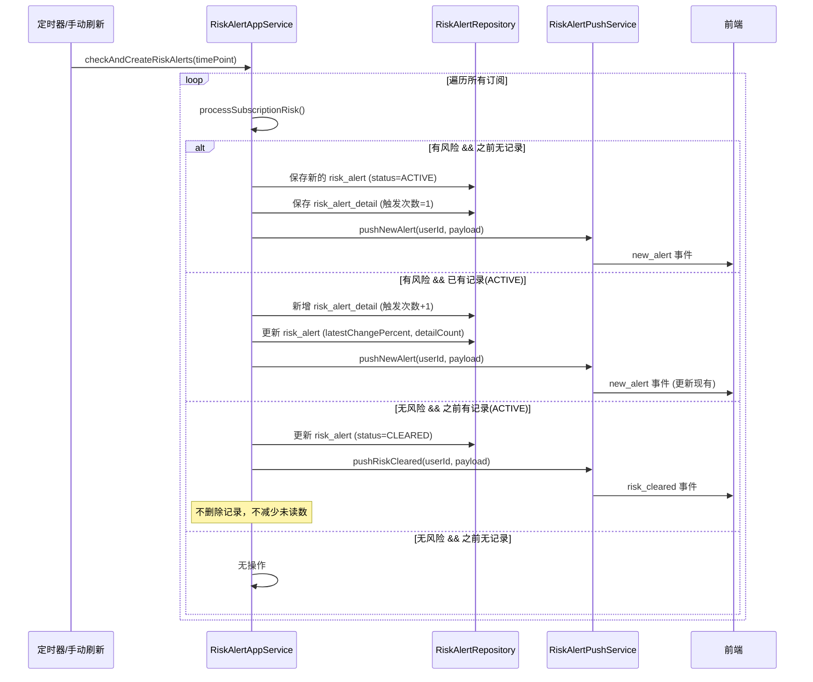
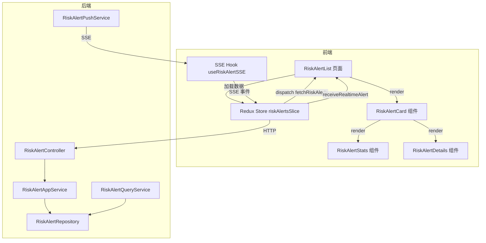

# 风险提醒页面功能重构 - 需求分析与架构规划

> 版本：v1.0
> 日期：2026-04-21
> 状态：设计阶段

---

## 1. 需求分析

### 1.1 需求要点理解

#### 需求一：按天区分风险 + 重点跟踪

**边界分析**：
- "今天"以中国交易日的自然日为准（00:00:00 ~ 23:59:59）
- 一旦某基金在今天触发过风险，从首次触发时间点（11:30 或 14:30）起，该基金在今天剩余时间内持续处于"重点跟踪"状态
- 重点跟踪状态不受风险解除影响——即使价格恢复到安全范围，只要当天未结束，跟踪不停止
- 每天 00:00:00 重置，所有基金恢复"未跟踪"状态

**与现有逻辑的区别**：
- 现有逻辑：`risk_cleared` 事件会删除整条 `risk_alert` 记录
- 新逻辑：`risk_cleared` 仅清除 active 状态，不删除记录；该标的在当天仍处于跟踪状态

#### 需求二：记录多个值

**前端展示字段**：

| 字段 | 类型 | 说明 | 精度 |
|------|------|------|------|
| 历史最高值 (maxChangePercent) | number | 今天内的最大涨幅（正数） | 2位小数 |
| 历史最低值 (minChangePercent) | number | 今天内的最大跌幅（负数） | 2位小数 |
| 当前最新值 (latestChangePercent) | number | 最近一次检测到的涨跌幅 | 2位小数 |

**数据来源**：
- `maxChangePercent` 和 `minChangePercent` 来自当日所有的 `risk_alert_detail` 记录
- `latestChangePercent` 来自当日最新的一条 `risk_alert_detail`

#### 需求三：无风险提示

**边界条件**：
- "当天内没有风险" = 数据库中该用户当天没有任何 `risk_alert` 记录
- 前端页面按日期分组显示：无数据的日期不显示；有数据的日期才显示
- "暂时无风险"提示只在**用户所在日期**（今天）且数据库无记录时显示
- 历史日期即使无数据也不显示提示

#### 需求四：页面重构

- 可以完全重新设计风险提醒页面
- 保留现有的 SSE 实时推送能力
- 保持与现有 API 的兼容性

### 1.2 关键业务流程



---

## 2. 数据模型设计

### 2.1 后端实体变更

#### 2.1.1 `RiskAlert` 实体 - 新增/变更字段

| 字段名 | 类型 | 说明 | 变更类型 |
|--------|------|------|----------|
| id | Long | 主键 | 不变 |
| userId | Long | 用户ID | 不变 |
| symbol | String | 标的代码 | 不变 |
| symbolType | String | STOCK/FUND | 不变 |
| symbolName | String | 标的名称 | 不变 |
| alertDate | LocalDate | 风险日期 | 不变 |
| timePoint | String | 时间点 | 不变 |
| hasRisk | Boolean | 是否有风险 | 不变 |
| changePercent | BigDecimal | 涨跌幅 | 不变 |
| currentPrice | BigDecimal | 当前价格 | 不变 |
| yesterdayClose | BigDecimal | 昨日收盘价 | 不变 |
| isRead | Boolean | 是否已读 | 不变 |
| triggeredAt | LocalDateTime | 触发时间 | 不变 |

**新增字段**：

| 字段名 | 类型 | 说明 | 默认值 |
|--------|------|------|--------|
| status | String | 跟踪状态: `ACTIVE` / `CLEARED` / `NO_ALERT` | `NO_ALERT` |
| maxChangePercent | BigDecimal | 当日最高涨幅 | 0.00 |
| minChangePercent | BigDecimal | 当日最低跌幅 | 0.00 |
| latestDetailId | Long | 最新一条 detail 的 ID | null |

**status 枚举说明**：
- `ACTIVE`: 今天触发过风险，当前处于跟踪状态
- `CLEARED`: 今天触发过风险，但当前已恢复到安全范围
- `NO_ALERT`: 今天从未触发过风险（无记录时）

#### 2.1.2 新增实体 `RiskAlertDetail`

> **用途说明**：该表记录每次触发时用户监控指标的具体值。根据用户订阅时选择的监控类型不同，记录的值类型也不同：
> - 如果用户选择"涨跌幅超过 X%" → 记录涨跌幅（百分比）
> - 如果用户选择"增减金额超过 Y 元" → 记录价格变化金额（元）

```java
@Data
public class RiskAlertDetail extends AggregateRoot<Long> {
    private Long riskAlertId;              // 关联的 risk_alert ID
    private String symbol;                 // 标的代码
    private BigDecimal changeValue;         // 触发时的监控指标值（涨跌幅百分比或价格变化金额）
    private BigDecimal changePercent;       // 触发时的涨跌幅百分比（用于展示，固定2位小数）
    private BigDecimal currentPrice;       // 触发时的价格 (2位小数)
    private LocalDateTime triggeredAt;     // 触发时间
    private String triggerReason;          // 触发原因：PRICE_CHANGE / PRICE_RANGE
    private String timePoint;             // 时间点：11:30 / 14:30
    private String alertType;             // 监控类型：PERCENT / AMOUNT（用户订阅时选择）
}
```

### 2.2 前端类型定义

#### 2.2.1 `RiskAlert` 类型（扩展）

```typescript
export interface RiskAlert {
  id: number
  symbol: string
  symbolName: string
  symbolType: 'STOCK' | 'FUND'
  date: string                      // YYYY-MM-DD
  status: 'ACTIVE' | 'CLEARED'     // 跟踪状态
  latestChangePercent: number       // 当前最新涨跌幅
  maxChangePercent: number          // 历史最高涨幅
  minChangePercent: number          // 历史最低跌幅
  currentPrice: number              // 当前价格
  yesterdayClose: number            // 昨日收盘价
  latestTriggeredAt: string         // 最新触发时间
  triggerCount: number              // 今日触发次数
  isRead: boolean
  details: RiskAlertDetail[]        // 明细列表
}
```

#### 2.2.2 `RiskAlertDetail` 类型

```typescript
export interface RiskAlertDetail {
  id: number
  changeValue: number          // 监控指标值（涨跌幅百分比或价格变化金额）
  changePercent: number       // 涨跌幅百分比（用于展示，固定2位小数）
  currentPrice: number
  triggeredAt: string
  triggerReason: string
  alertType: 'PERCENT' | 'AMOUNT'  // 监控类型
}
```

### 2.3 SSE 推送 Payload 变更

#### 2.3.1 `NewAlertPayload` - 扩展

```java
public class NewAlertPayload {
    private Long id;                          // risk_alert ID
    private String symbol;
    private String symbolName;
    private String symbolType;
    private String date;                      // YYYY-MM-DD
    private String status;                    // ACTIVE / CLEARED
    private BigDecimal latestChangePercent;   // 当前最新涨跌幅
    private BigDecimal maxChangePercent;      // 当日最高涨幅
    private BigDecimal minChangePercent;      // 当日最低跌幅
    private BigDecimal currentPrice;
    private BigDecimal yesterdayClose;
    private String latestTriggeredAt;
    private int triggerCount;                // 当日触发次数
    private boolean isRead;
    private List<RiskAlertDetailPayload> details;
}
```

#### 2.3.2 `RiskClearedPayload` - 变更

```java
public class RiskClearedPayload {
    private Long id;
    private String symbol;
    private String symbolName;
    private String symbolType;
    private String date;
    private String status;                    // 新增：始终为 CLEARED
    private BigDecimal lastChangePercent;     // 解除前的涨跌幅
    private BigDecimal currentChangePercent;  // 当前涨跌幅（已恢复）
    private BigDecimal maxChangePercent;      // 当日最高涨幅（保留）
    private BigDecimal minChangePercent;      // 当日最低跌幅（保留）
    private BigDecimal currentPrice;
    private String latestTriggeredAt;
    private int triggerCount;                // 当日触发次数（保留）
}
```

---

## 3. 数据库变更

### 3.1 DDL 变更

#### 3.1.1 修改 `risk_alert` 表

```sql
-- 新增字段
ALTER TABLE risk_alert ADD COLUMN status VARCHAR(20) DEFAULT 'NO_ALERT';
ALTER TABLE risk_alert ADD COLUMN max_change_percent DECIMAL(10, 2) DEFAULT 0.00;
ALTER TABLE risk_alert ADD COLUMN min_change_percent DECIMAL(10, 2) DEFAULT 0.00;
ALTER TABLE risk_alert ADD COLUMN latest_detail_id BIGINT;

-- 添加注释
COMMENT ON COLUMN risk_alert.status IS '跟踪状态: ACTIVE-跟踪中, CLEARED-已解除, NO_ALERT-无风险';
COMMENT ON COLUMN risk_alert.max_change_percent IS '当日最高涨幅';
COMMENT ON column risk_alert.min_change_percent IS '当日最低跌幅';
COMMENT ON COLUMN risk_alert.latest_detail_id IS '最新一条detail的ID';

-- 添加索引
CREATE INDEX idx_risk_alert_status ON risk_alert(user_id, alert_date, status);
CREATE INDEX idx_risk_alert_latest_detail ON risk_alert(latest_detail_id);
```

#### 3.1.2 新建 `risk_alert_detail` 表

```sql
CREATE TABLE risk_alert_detail (
    id BIGSERIAL PRIMARY KEY,
    risk_alert_id BIGINT NOT NULL,
    symbol VARCHAR(20) NOT NULL,
    change_value DECIMAL(10, 4) NOT NULL COMMENT '监控指标值（涨跌幅百分比或价格变化金额，根据alert_type区分）',
    change_percent DECIMAL(10, 2) NOT NULL COMMENT '涨跌幅百分比（用于展示，固定2位小数）',
    current_price DECIMAL(10, 2) NOT NULL COMMENT '触发时价格(2位小数)',
    triggered_at TIMESTAMP NOT NULL DEFAULT CURRENT_TIMESTAMP,
    trigger_reason VARCHAR(50) DEFAULT 'PRICE_CHANGE',
    time_point VARCHAR(10) NOT NULL COMMENT '11:30 或 14:30',
    alert_type VARCHAR(20) NOT NULL COMMENT 'PERCENT-涨跌幅监控, AMOUNT-增减金额监控',
    created_at TIMESTAMP DEFAULT CURRENT_TIMESTAMP,
    
    CONSTRAINT fk_risk_alert_detail_risk_alert 
        FOREIGN KEY (risk_alert_id) REFERENCES risk_alert(id) ON DELETE CASCADE
);

-- 添加索引
CREATE INDEX idx_risk_alert_detail_risk_alert_id ON risk_alert_detail(risk_alert_id);
CREATE INDEX idx_risk_alert_detail_triggered_at ON risk_alert_detail(triggered_at);
CREATE INDEX idx_risk_alert_detail_symbol_triggered ON risk_alert_detail(symbol, triggered_at);
```

### 3.2 初始化数据的迁移策略

由于现有 `risk_alert` 记录是历史数据，迁移时：

1. 将所有现有记录的 `status` 设置为 `CLEARED`（表示"历史已结束"）
2. 将 `max_change_percent` 和 `min_change_percent` 初始化为当前的 `change_percent`
3. 不迁移历史记录到 `risk_alert_detail` 表（历史数据只保留汇总）

---

## 4. API 接口设计

### 4.1 现有接口变更

#### 4.1.1 `GET /api/risk-alerts/user/{userId}` - 响应变更

**变更说明**：返回数据中增加 `status`, `maxChangePercent`, `minChangePercent` 字段。

**响应示例**：

```json
{
  "success": true,
  "data": [
    {
      "id": 123,
      "symbol": "000001",
      "symbolName": "平安银行",
      "symbolType": "STOCK",
      "date": "2026-04-21",
      "status": "ACTIVE",
      "latestChangePercent": -2.35,
      "maxChangePercent": -1.20,
      "minChangePercent": -3.50,
      "currentPrice": 12.35,
      "yesterdayClose": 12.65,
      "latestTriggeredAt": "2026-04-21T11:35:00+08:00",
      "triggerCount": 2,
      "isRead": false,
      "details": [
        {
          "id": 1001,
          "changeValue": -1.20,
          "changePercent": -1.20,
          "currentPrice": 12.50,
          "triggeredAt": "2026-04-21T11:30:00+08:00",
          "triggerReason": "PRICE_CHANGE",
          "alertType": "PERCENT"
        },
        {
          "id": 1002,
          "changeValue": -2.35,
          "changePercent": -2.35,
          "currentPrice": 12.35,
          "triggeredAt": "2026-04-21T11:35:00+08:00",
          "triggerReason": "PRICE_CHANGE",
          "alertType": "PERCENT"
        }
      ]
    }
  ],
  "total": 1,
  "page": 1,
  "size": 20
}
```

#### 4.1.2 `GET /api/risk-alerts/user/{userId}/unread-count` - 不变

### 4.2 新增接口

#### 4.2.1 `GET /api/risk-alerts/user/{userId}/today-summary` - 当日汇总

**功能**：获取用户当日的风险提醒汇总，用于页面初始化和"暂时无风险"判断。

**请求**：

```
GET /api/risk-alerts/user/{userId}/today-summary
```

**响应**：

```json
{
  "success": true,
  "data": {
    "date": "2026-04-21",
    "hasAlerts": true,
    "totalCount": 3,
    "activeCount": 1,
    "clearedCount": 2,
    "alerts": [
      {
        "id": 123,
        "symbol": "000001",
        "symbolName": "平安银行",
        "symbolType": "STOCK",
        "status": "ACTIVE",
        "latestChangePercent": -2.35,
        "maxChangePercent": -1.20,
        "minChangePercent": -3.50,
        "currentPrice": 12.35,
        "latestTriggeredAt": "2026-04-21T11:35:00+08:00",
        "triggerCount": 2
      }
    ]
  }
}
```

**无风险响应**：

```json
{
  "success": true,
  "data": {
    "date": "2026-04-21",
    "hasAlerts": false,
    "totalCount": 0,
    "activeCount": 0,
    "clearedCount": 0,
    "alerts": []
  }
}
```

#### 4.2.2 `GET /api/risk-alerts/user/{userId}/details/{alertId}` - 获取明细列表

**功能**：获取某个风险提醒的所有明细记录。

**请求**：

```
GET /api/risk-alerts/user/{userId}/details/{alertId}?page=1&size=10
```

**响应**：

```json
{
  "success": true,
  "data": {
    "alertId": 123,
    "symbol": "000001",
    "totalCount": 5,
    "details": [
      {
        "id": 1001,
        "changeValue": -1.20,
        "changePercent": -1.20,
        "currentPrice": 12.50,
        "triggeredAt": "2026-04-21T11:30:00+08:00",
        "triggerReason": "PRICE_CHANGE",
        "timePoint": "11:30",
        "alertType": "PERCENT"
      }
    ]
  }
}
```

### 4.3 SSE 事件类型变更

| 事件类型 | 触发时机 | 说明 |
|----------|----------|------|
| `init` | 连接建立后 | 携带当前未读数和今日汇总 |
| `ping` | 每 30 秒 | 心跳保活 |
| `new_alert` | 新的风险提醒产生或更新 | 推送完整提醒数据（含明细列表） |
| `alert_cleared` | 风险解除（价格恢复到安全范围） | 推送更新后的状态（status=CLEARED） |
| `unread_count_change` | 未读数量变化 | 仅推送数量变化 |

**`new_alert` 事件 payload 变更**：
- 新增 `status` 字段
- 新增 `maxChangePercent` / `minChangePercent` 字段
- 新增 `triggerCount` 字段
- `details` 包含当日所有明细

**`alert_cleared` 事件 payload**：

```json
{
  "id": 123,
  "symbol": "000001",
  "symbolName": "平安银行",
  "symbolType": "STOCK",
  "date": "2026-04-21",
  "status": "CLEARED",
  "lastChangePercent": -0.65,
  "currentChangePercent": -0.65,
  "maxChangePercent": -1.20,
  "minChangePercent": -3.50,
  "currentPrice": 12.50,
  "latestTriggeredAt": "2026-04-21T11:35:00+08:00",
  "triggerCount": 2
}
```

---

## 5. 前端组件设计

### 5.1 页面布局设计

```
┌─────────────────────────────────────────────────────────────────┐
│  Header                                                          │
│  ┌─────────────────────────────────────────────────────────────┐ │
│  │ [铃铛图标] 风险提醒 (3)                      [全部已读]       │ │
│  └─────────────────────────────────────────────────────────────┘ │
├─────────────────────────────────────────────────────────────────┤
│  RiskAlertList Page                                              │
│                                                                  │
│  ┌─────────────────────────────────────────────────────────────┐ │
│  │  2026-04-21 (今天)                              [今日汇总]  │ │
│  │  ┌─────────────────────────────────────────────────────────┐│ │
│  │  │ 📈 平安银行 (000001) - 股票                    ACTIVE   ││ │
│  │  │                                                        ││ │
│  │  │   当前: -2.35%  │  最高: -1.20%  │  最低: -3.50%       ││ │
│  │  │   价格: ¥12.35  │  触发: 2次     │  最新: 11:35        ││ │
│  │  │                                                        ││ │
│  │  │   [展开明细 ▼]                                        ││ │
│  │  │   ┌───────────────────────────────────────────────┐   ││ │
│  │  │   │ 11:35 │ -2.35% │ ¥12.35 │ PERCENT │ PRICE_CHANGE │   ││ │
│  │  │   │ 11:30 │ -1.20% │ ¥12.50 │ PERCENT │ PRICE_CHANGE │   ││ │
│  │  │   └───────────────────────────────────────────────┘   ││ │
│  │  └─────────────────────────────────────────────────────────┘│ │
│  │  ┌─────────────────────────────────────────────────────────┐│ │
│  │  │ 📉 沪深300ETF (510300) - 基金              CLEARED    ││ │
│  │  │                                                        ││ │
│  │  │   当前: -0.65%  │  最高: -1.50%  │  最低: -2.10%       ││ │
│  │  │   [已恢复到安全范围]                                   ││ │
│  │  └─────────────────────────────────────────────────────────┘│ │
│  └─────────────────────────────────────────────────────────────┘ │
│                                                                  │
│  ┌─────────────────────────────────────────────────────────────┐ │
│  │  2026-04-18 (周五)                                          │ │
│  │  ┌─────────────────────────────────────────────────────────┐│ │
│  │  │ ...                                                     ││ │
│  │  └─────────────────────────────────────────────────────────┘│ │
│  └─────────────────────────────────────────────────────────────┘ │
│                                                                  │
│  ─────────────── 无风险提示（仅今天无数据时显示） ─────────────── │
│  ┌─────────────────────────────────────────────────────────────┐ │
│  │                                                              │ │
│  │              ✅ 暂时无风险，市场波动正常                      │ │
│  │                                                              │ │
│  └─────────────────────────────────────────────────────────────┘ │
│                                                                  │
└─────────────────────────────────────────────────────────────────┘
```

### 5.2 组件结构

```
src/
├── pages/
│   └── risk-alerts/
│       └── RiskAlertList.tsx          # 主页面（重构）
├── components/
│   └── risk-alerts/
│       ├── RiskAlertCard.tsx          # 单条风险提醒卡片
│       ├── RiskAlertHeader.tsx        # 页面头部（标题 + 全部已读）
│       ├── RiskAlertStats.tsx         # 统计信息（最高/最低/当前）
│       ├── RiskAlertDetails.tsx       # 明细列表（可折叠）
│       ├── RiskAlertDetailItem.tsx    # 单条明细
│       ├── RiskAlertEmpty.tsx         # 无风险提示
│       └── RiskAlertDateGroup.tsx     # 按日期分组
├── hooks/
│   └── useRiskAlertSSE.ts             # SSE 连接（已存在，需扩展）
├── store/
│   └── slices/
│       └── riskAlertsSlice.ts         # Redux slice（需扩展）
├── services/
│   ├── api/
│   │   └── riskAlerts.ts             # API 调用（需扩展）
│   └── sse/
│       └── riskAlertSSE.ts           # SSE 客户端（需扩展）
└── types/
    └── index.ts                       # 类型定义（已扩展）
```

### 5.3 数据流



### 5.4 状态管理扩展

#### 5.4.1 Redux Slice 扩展

```typescript
interface RiskAlertState {
  list: RiskAlert[]                    // 风险提醒列表（按日期分组）
  unreadCount: number                  // 未读数
  todaySummary: TodaySummary | null    // 当日汇总（新增）
  loading: boolean
  hasMore: boolean
  cursor: number | null
  error: string | null
}

interface TodaySummary {
  date: string
  hasAlerts: boolean
  totalCount: number
  activeCount: number
  clearedCount: number
  alerts: RiskAlert[]
}
```

#### 5.4.2 Reducers 变更

| Reducer | 说明 |
|---------|------|
| `fetchRiskAlerts` | 现有，扩展响应处理 |
| `fetchTodaySummary` | **新增** - 获取当日汇总 |
| `receiveRealtimeAlert` | 现有，扩展 status / maxChangePercent / minChangePercent 处理 |
| `receiveAlertCleared` | **重构** - 更新 status 为 CLEARED，不从列表移除 |
| `markAllAsRead` | 现有 |

---

## 6. 后端核心逻辑变更

### 6.1 `RiskAlertAppServiceImpl` 变更

#### 6.1.1 `createOrUpdateRiskAlert` 逻辑调整

```
旧逻辑：
- 新建记录 → 保存 → 推送 new_alert
- 更新记录 → 更新 → 推送 new_alert

新逻辑：
- 查询当日是否存在该标的的 ACTIVE 记录
- 不存在 → 新建 risk_alert (status=ACTIVE)，新建 risk_alert_detail，保存 max/min_change_percent
- 存在 → 新增 risk_alert_detail，更新 risk_alert 的 latestChangePercent, maxChangePercent, minChangePercent, latestDetailId
- 始终推送 new_alert（SSE）
```

#### 6.1.2 `processSubscriptionRisk` 逻辑调整

```
旧逻辑：
- 无风险 && 之前有记录 → 删除记录 → 推送 risk_cleared → unreadCount -1

新逻辑：
- 无风险 && 之前有记录(status=ACTIVE) → 更新 status=CLEARED，不删除记录 → 推送 alert_cleared → 不减少未读数
- 无风险 && 之前无记录 → 无操作
- 有风险 && 之前无记录 → 新建 ACTIVE 记录
- 有风险 && 之前有记录 → 更新 latestChangePercent
```

### 6.2 新增方法

| 方法 | 说明 |
|------|------|
| `RiskAlertAppService.getTodaySummary(Long userId)` | 获取当日汇总 |
| `RiskAlertAppService.getAlertDetails(Long alertId, int page, int size)` | 获取明细列表 |
| `RiskAlertQueryService.getTodaySummary(Long userId, LocalDate date)` | 查询汇总 |
| `RiskAlertQueryService.getAlertDetails(Long alertId, int page, int size)` | 查询明细 |

---

## 7. 实现步骤

### 阶段一：数据库与后端基础设施

1. **数据库迁移**
   - [ ] 创建 `risk_alert_detail` 表
   - [ ] 修改 `risk_alert` 表（新增 status, max_change_percent, min_change_percent, latest_detail_id）
   - [ ] 编写迁移脚本并测试

2. **后端实体**
   - [ ] 新建 `RiskAlertDetail` 实体类
   - [ ] 修改 `RiskAlert` 实体（新增字段）
   - [ ] 更新 JPA Repository

3. **后端 Service 层**
   - [ ] 修改 `RiskAlertAppServiceImpl.createOrUpdateRiskAlert` 逻辑
   - [ ] 修改 `RiskAlertAppServiceImpl.processSubscriptionRisk` 逻辑
   - [ ] 实现 `getTodaySummary` 方法
   - [ ] 实现 `getAlertDetails` 方法

4. **后端 Query 层**
   - [ ] 实现 `RiskAlertQueryService.getTodaySummary`
   - [ ] 实现 `RiskAlertQueryService.getAlertDetails`

5. **SSE 推送**
   - [ ] 更新 `NewAlertPayload` DTO
   - [ ] 新增 `AlertClearedPayload` DTO
   - [ ] 更新 `InMemoryRiskAlertPushService` 添加 `pushAlertCleared` 方法

### 阶段二：API 接口

6. **Controller 层**
   - [ ] 修改 `RiskAlertController.getRiskAlerts` 响应结构
   - [ ] 新增 `GET /api/risk-alerts/user/{userId}/today-summary`
   - [ ] 新增 `GET /api/risk-alerts/user/{userId}/details/{alertId}`

7. **API 文档更新**
   - [ ] 更新 `realtime-risk-alert-push-api.md`

### 阶段三：前端

8. **类型定义**
   - [ ] 扩展 `RiskAlert` 类型（新增 status, maxChangePercent, minChangePercent）
   - [ ] 新增 `RiskAlertDetail` 类型
   - [ ] 新增 `TodaySummary` 类型

9. **API 服务层**
   - [ ] 新增 `getTodaySummary` API 方法
   - [ ] 新增 `getAlertDetails` API 方法

10. **Redux Slice**
    - [ ] 扩展 state 类型
    - [ ] 新增 `fetchTodaySummary` thunk
    - [ ] 修改 `receiveRealtimeAlert` reducer
    - [ ] 重构 `receiveAlertCleared` reducer

11. **SSE 客户端**
    - [ ] 更新 `NewAlertEvent` 类型
    - [ ] 新增 `AlertClearedEvent` 类型
    - [ ] 更新 SSE 事件处理逻辑

12. **组件开发**
    - [ ] 重构 `RiskAlertList` 主页面
    - [ ] 开发 `RiskAlertCard` 组件
    - [ ] 开发 `RiskAlertStats` 组件
    - [ ] 开发 `RiskAlertDetails` 组件
    - [ ] 开发 `RiskAlertDetailItem` 组件
    - [ ] 开发 `RiskAlertEmpty` 组件
    - [ ] 开发 `RiskAlertDateGroup` 组件

13. **PRD 文档更新**
    - [ ] 更新 `realtime-risk-alert-push-prd.md`

### 阶段四：测试与验证

14. **单元测试**
    - [ ] 后端 Service 层单元测试
    - [ ] 前端组件单元测试

15. **集成测试**
    - [ ] API 接口集成测试
    - [ ] SSE 推送集成测试

16. **E2E 测试**
    - [ ] 风险提醒页面 E2E 测试
    - [ ] 多端同步测试

---

## 8. 风险与注意事项

### 8.1 数据迁移风险

- 历史 `risk_alert` 记录的 `max_change_percent` 和 `min_change_percent` 需要从现有 `change_percent` 初始化
- 对于历史记录，不迁移到 `risk_alert_detail` 表，保持现有数据不变

### 8.2 兼容性问题

- SSE 推送的 `new_alert` 事件 payload 结构发生变化，前端需要同步更新
- 现有 `risk_cleared` 事件含义改变（不再删除记录），前端需要调整处理逻辑

### 8.3 性能考量

- `risk_alert_detail` 表的数据量随时间增长，需要定期清理（保留 30 天）
- 查询当日汇总时需要考虑索引命中

---

## 9. 附录

### 9.1 字段精度规范

| 类别 | 字段 | 精度 | 数据库类型 |
|------|------|------|------------|
| 涨跌幅 | changePercent, maxChangePercent, minChangePercent, latestChangePercent | 2位小数 | DECIMAL(10,2) |
| 价格 | currentPrice, yesterdayClose | 2位小数 | DECIMAL(10,2) |

### 9.2 状态机

```
                    ┌─────────────────┐
                    │   NO_ALERT      │
                    │  (无记录)       │
                    └────────┬────────┘
                             │ 有风险触发
                             ▼
                    ┌─────────────────┐
         ┌─────────│    ACTIVE       │◄────────────┐
         │         │  (跟踪中)       │             │
         │         └─────────────────┘             │
         │                    │                    │
         │                    │ 风险解除          │ 有风险再次触发
         │                    ▼                    │
         │         ┌─────────────────┐             │
         │         │    CLEARED      │─────────────┘
         │         │   (已解除)      │
         │         └─────────────────┘
         │
         │  每天 00:00 重置所有状态
         │
         └────────────────────────────────────────┘
```
