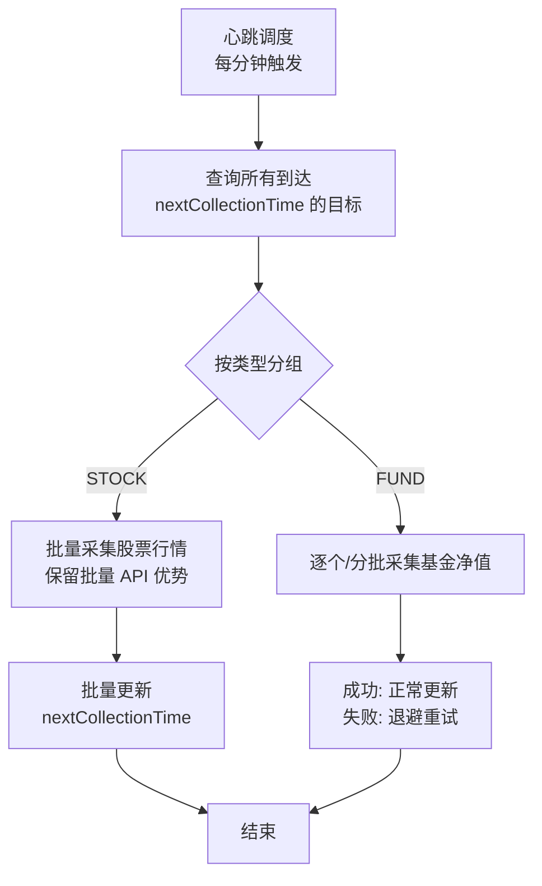

# 基金采集频率独立调度功能 - 设计文档（修订版）

## 1. 背景与目标

### 1.1 现状分析

当前系统存在以下问题：

| 现状 | 问题 |
|------|------|
| `DataCollectionScheduler` 使用固定 cron 调度 | 所有基金统一按固定周期采集，无法差异化 |
| `collectionFrequency` 字段仅用于计算 `nextCollectionTime` | 实际调度时未按各目标独立频率执行 |
| 前端 `collectionFrequency` 使用字符串枚举（DAILY/HOURLY/REAL_TIME） | 与后端 `Integer` 类型不匹配，保存可能失效 |

### 1.2 核心目标

实现**按目标独立频率采集**的机制：
- 前端可修改单个基金的采集频率
- 后端按照各基金设定的 `collectionFrequency` 独立触发采集
- 保持现有 Spring Scheduler 框架不变
- 不引入额外定时器线程
- **改造现有 `DataCollectionScheduler`，不新增独立调度类**

---

## 2. 整体架构设计

### 2.1 核心设计思想

**"固定心跳 + 动态决策"** 模式：



**关键点**：
1. 保留心跳调度（每分钟），避免创建大量独立定时器
2. 根据 `nextCollectionTime <= now` 判断是否需要采集
3. 采集完成后更新 `nextCollectionTime = now + frequency`
4. **采集失败时设置退避时间（1 分钟后重试），防止死循环**
5. **股票保留批量采集，不逐个调用外部 API**

### 2.2 数据模型

#### 2.2.1 数据库变更（无需修改）

现有表结构已满足需求：

```sql
-- data_collection_target 表已有字段：
collection_frequency INTEGER DEFAULT 15,  -- 采集频率(分钟)
next_collection_time TIMESTAMP,           -- 下次采集时间
last_collected_time TIMESTAMP,            -- 最后采集时间
active BOOLEAN DEFAULT TRUE,             -- 是否激活
```

#### 2.2.2 字段含义澄清

| 字段 | 用途 | 说明 |
|------|------|------|
| `collectionFrequency` | 目标独立采集间隔 | 前端修改此值可改变采集频率 |
| `nextCollectionTime` | 调度决策依据 | 每次采集后更新为 `now + frequency` |
| `lastCollectedTime` | 审计追踪 | 记录最近一次成功采集时间 |

---

## 3. 后端调度机制改造

### 3.1 改造方案：改造现有 DataCollectionScheduler

**不新增 `DynamicFrequencyCollector` 类**，直接改造现有 `DataCollectionScheduler`，避免与现有调度逻辑冲突和重复采集。

#### 3.1.1 废弃 fund-quote-cron 固定调度

将原有 `scheduleFundQuoteCollection`（固定每 15 分钟）废弃，基金采集并入心跳调度内的动态决策逻辑。

#### 3.1.2 改造 scheduleStockQuoteCollection

现有方法已每分钟执行，在此基础上增加**动态过滤**逻辑：

```java
@Scheduled(cron = "${data.collection.schedule.stock-quote-cron}")
public void scheduleStockQuoteCollection() {
    LocalDateTime now = LocalDateTime.now();

    // 1. 查询所有 active 且到达采集时间的目标（复用现有方法）
    List<DataCollectionTarget> readyTargets = dataCollectionTargetAppService.getTargetsNeedingCollection();

    // 2. 分离股票和基金
    List<DataCollectionTarget> stockTargets = readyTargets.stream()
        .filter(t -> "STOCK".equals(t.getType()) && Boolean.TRUE.equals(t.getActive()))
        .toList();

    List<DataCollectionTarget> fundTargets = readyTargets.stream()
        .filter(t -> "FUND".equals(t.getType()) && Boolean.TRUE.equals(t.getActive()))
        .toList();

    // 3. 股票：保留批量采集优势
    if (!stockTargets.isEmpty()) {
        List<String> symbols = stockTargets.stream()
            .map(DataCollectionTarget::getFullCode)
            .toList();
        try {
            List<StockQuote> quotes = dataCollectionAppService.collectStockQuotes(symbols);
            dataProcessingAppService.processStockQuotes(quotes);
            // 批量更新采集时间
            batchUpdateCollectionTime(stockTargets, now, true);
        } catch (Exception e) {
            logger.error("Failed to collect stock quotes batch", e);
            // 批量退避：全部延后 1 分钟重试
            batchUpdateCollectionTime(stockTargets, now.plusMinutes(1), false);
        }
    }

    // 4. 基金：按目标独立频率逐个采集
    List<DataCollectionTarget> successfulFunds = new ArrayList<>();
    List<DataCollectionTarget> failedFunds = new ArrayList<>();

    for (DataCollectionTarget target : fundTargets) {
        try {
            FundQuote quote = dataCollectionAppService.fetchFundRealTimeData(target.getCode());
            if (quote != null) {
                dataProcessingAppService.processFundQuote(quote);
                successfulFunds.add(target);
            } else {
                failedFunds.add(target);
            }
        } catch (Exception e) {
            logger.error("Failed to collect fund target: {}", target.getCode(), e);
            failedFunds.add(target);
        }
    }

    // 5. 批量更新时间（成功 = now + frequency，失败 = now + 1min 退避）
    if (!successfulFunds.isEmpty()) {
        batchUpdateCollectionTime(successfulFunds, now, true);
    }
    if (!failedFunds.isEmpty()) {
        batchUpdateCollectionTime(failedFunds, now.plusMinutes(1), false);
    }
}
```

#### 3.1.3 批量更新时间工具方法

```java
private void batchUpdateCollectionTime(List<DataCollectionTarget> targets, LocalDateTime baseTime, boolean success) {
    for (DataCollectionTarget target : targets) {
        target.setLastCollectedTime(success ? baseTime : target.getLastCollectedTime());
        int frequency = target.getCollectionFrequency() != null ? target.getCollectionFrequency() : 15;
        target.setNextCollectionTime(baseTime.plusMinutes(success ? frequency : 0));
        // 注意：失败时 baseTime 已经是 now + 1min，所以 plusMinutes(0)
    }
    // 使用 MyBatis-Plus 批量更新
    dataCollectionTargetAppService.updateBatch(targets);
}
```

> **说明**：`updateBatch` 应通过 Mapper 调用 MyBatis-Plus 的 `updateBatchById` 或自定义批量 UPDATE SQL，避免循环 `save()`。

#### 3.1.4 废弃 scheduleFundQuoteCollection

```java
/**
 * 【已废弃】基金实时净值独立频率调度已合并至 scheduleStockQuoteCollection。
 * 保留方法体为空或删除，避免重复采集。
 */
@Scheduled(cron = "${data.collection.schedule.fund-quote-cron}")
public void scheduleFundQuoteCollection() {
    // NO-OP: 基金采集已并入每分钟心跳调度的动态决策逻辑
    logger.debug("scheduleFundQuoteCollection is deprecated. Fund collection is handled by dynamic frequency scheduler.");
}
```

### 3.2 复用现有 Repository 查询

现有 [`DataCollectionTargetMapper.xml:33`](backend/src/main/resources/mapper/DataCollectionTargetMapper.xml:33) 的 `findTargetsNeedingCollection` 已满足需求：

```sql
SELECT * FROM data_collection_target
WHERE active = true
AND (next_collection_time IS NULL OR next_collection_time <= NOW())
ORDER BY type, code
```

**无需新增 `findTargetsReadyForCollection`**。如需限制单次处理数量，可在 Java 层对返回 List 做 `stream().limit(MAX_BATCH_SIZE)`。

### 3.3 频率变更时同步生效

当用户修改 `collectionFrequency` 时，必须同步重置 `nextCollectionTime`，否则新频率不会立即生效。

修改 [`FundAppServiceImpl.updateFund()`](backend/src/main/java/com/stock/fund/application/service/fund/impl/FundAppServiceImpl.java:46)：

```java
@Override
@Transactional(rollbackFor = Exception.class)
public FundDTO updateFund(Long id, UpdateFundRequest request) {
    DataCollectionTarget target = dataCollectionTargetRepository.findById(id)
        .orElseThrow(() -> new IllegalArgumentException("Fund not found: id=" + id));

    // ... 其他字段更新 ...

    if (request.getCollectionFrequency() != null) {
        int oldFreq = target.getCollectionFrequency() != null ? target.getCollectionFrequency() : 15;
        int newFreq = request.getCollectionFrequency();
        target.setCollectionFrequency(newFreq);

        // 频率变更时，立即重置 nextCollectionTime，使新频率生效
        if (oldFreq != newFreq) {
            target.setNextCollectionTime(LocalDateTime.now().plusMinutes(newFreq));
            logger.info("Fund {} frequency changed from {} to {} min, nextCollectionTime reset",
                target.getCode(), oldFreq, newFreq);
        }
    }

    DataCollectionTarget savedTarget = dataCollectionTargetRepository.save(target);
    return FundDTO.fromEntity(savedTarget);
}
```

同理，[`DataCollectionTargetAppServiceImpl.updateTarget()`](backend/src/main/java/com/stock/fund/application/service/impl/DataCollectionTargetAppServiceImpl.java:67) 也需加入相同逻辑。

---

## 4. 前端改动

### 4.1 类型定义修正

将 `collectionFrequency` 从 `string` 改为 `number`，与后端 `Integer` 对齐。

**`app/src/types/index.ts`**：

```typescript
export interface Fund {
  // ... 其他字段 ...
  collectionFrequency?: number  // 从 string 改为 number
}

export interface FundUpdateRequest {
  // ... 其他字段 ...
  collectionFrequency?: number  // 从 string 改为 number
}
```

### 4.2 频率选项改造

**`app/src/components/funds/FundEditModal.tsx`**：

```typescript
// 修改前（字符串枚举，与后端不匹配）
// const COLLECTION_FREQUENCY_OPTIONS = [
//     { value: 'DAILY', label: '每日' },
//     { value: 'HOURLY', label: '每小时' },
//     { value: 'REAL_TIME', label: '实时' }
// ]

// 修改后：数值与后端 Integer 对应
const COLLECTION_FREQUENCY_OPTIONS = [
    { value: 1440, label: '每日' },
    { value: 60, label: '每小时' },
    { value: 15, label: '每15分钟' },
    { value: 5, label: '每5分钟' },
    { value: 1, label: '实时（每分钟）' }
]
```

表单初始化时确保回显正确：

```typescript
useEffect(() => {
    if (!visible) {
        form.resetFields()
    } else if (fund) {
        form.setFieldsValue({
            // ... 其他字段 ...
            collectionFrequency: fund.collectionFrequency ?? 15, // 默认15分钟
        })
    }
}, [visible, fund, form])
```

### 4.3 API 接口验证

[`funds.ts`](app/src/services/api/funds.ts) 的 `updateFund` 接口无需修改，只需确保请求体中 `collectionFrequency` 为整数即可：

```typescript
updateFund: (id: number, data: FundUpdateRequest) =>
    apiClient.put<ApiResponse<Fund>>(`/funds/${id}`, data),
```

---

## 5. 兼容性处理

### 5.1 调度器兼容性矩阵

| 调度器 | 处理内容 | 策略 |
|--------|----------|------|
| `scheduleStockBasicCollection` | 股票基本信息（凌晨 2 点） | **保留** — 批量更新股票基础数据是独立后台任务 |
| `scheduleFundBasicCollection` | 基金基本信息（凌晨 3 点） | **保留** — 批量更新基金基础信息 |
| `scheduleStockQuoteCollection` | 股票实时行情 + 基金实时净值 | **改造** — 增加动态频率过滤逻辑 |
| `scheduleFundQuoteCollection` | 基金实时净值（每 15 分钟） | **废弃置空** — 逻辑并入 `scheduleStockQuoteCollection` |
| `scheduleDailyCollection` | 日终批量采集（16 点） | **保留** — 日终数据汇总 |

### 5.2 存量数据兼容

- 存量目标若 `collectionFrequency` 为 `null`，沿用默认值 **15 分钟**（与现有行为一致）。
- 存量目标若 `nextCollectionTime` 为 `null`，首次心跳会立即触发采集（`findTargetsNeedingCollection` 中 `IS NULL` 条件）。
- 前端已有数据的 `collectionFrequency` 回显：若后端返回整数则直接显示；若为 `null` 则默认选中 15 分钟。

---

## 6. 关键边界场景处理

### 6.1 交易时间外的心跳

心跳 cron 限定在交易时间内（`9-15 点`），非交易时间不触发，因此无需额外判断交易时间。

### 6.2 外部 API 故障

- 单目标采集失败 → `nextCollectionTime = now + 1min`
- 批量股票采集失败 → 整批延后 1 分钟
- 避免无限重试：1 分钟退避后若继续失败，每次心跳仍延后 1 分钟，不会堆积

### 6.3 高频目标（1 分钟）与低频目标（1 天）共存

- 心跳每分钟触发，1 分钟频率的目标每次都会被采集
- 1440 分钟频率的目标一天只会在 `nextCollectionTime <= now` 时触发一次
- 互不影响

### 6.4 大量目标（1000+）的性能

- 使用 `LIMIT` 控制单次处理量（可在 Java 层 `stream().limit(100)`）
- 股票保持批量 API 调用，减少网络往返
- 基金采集若目标过多，考虑在 `fetchFundRealTimeData` 内增加线程池异步处理（二期优化）

---

## 7. 实现路径

### 阶段一：基础设施（1 天）

| 任务 | 产出 |
|------|------|
| 前端 `types/index.ts` 中 `collectionFrequency` 改为 `number` | 类型对齐 |
| 前端 `FundEditModal` 频率选项改为数值 | UI 适配 |
| 后端 `FundAppServiceImpl.updateFund()` 增加频率变更时重置 `nextCollectionTime` | 频率即时生效 |
| 后端 `DataCollectionTargetAppServiceImpl.updateTarget()` 增加同上逻辑 | 双入口覆盖 |

### 阶段二：核心调度改造（2 天）

| 任务 | 产出 |
|------|------|
| 改造 `DataCollectionScheduler.scheduleStockQuoteCollection()`，增加动态过滤和批量更新 | 股票+基金统一心跳调度 |
| 废弃 `scheduleFundQuoteCollection()`（方法体置空并加注释） | 避免重复采集 |
| Mapper 新增 `updateBatch` 批量更新 `next_collection_time` / `last_collected_time` | 性能优化 |
| 单元测试：验证动态过滤、批量更新、失败退避逻辑 | 80%+ 覆盖率 |

### 阶段三：集成与验收（1-2 天）

| 任务 | 产出 |
|------|------|
| 前后端联调：修改频率 → 验证 `nextCollectionTime` 更新 → 验证采集间隔 | 端到端验证 |
| E2E 测试：创建基金 → 修改频率为 1 分钟 → 等待并验证采集记录 | Playwright 测试 |
| 性能验证：模拟 500+ 目标，确认单次心跳执行耗时 < 30s | 性能基线 |
| 更新 `SCHEDULER_GUIDE.md` | 文档同步 |

---

## 8. 设计决策记录（ADR）

### ADR-1：为什么改造现有类，而不是新增 DynamicFrequencyCollector？

- **避免重复采集**：现有 `scheduleStockQuoteCollection` 已包含 `fetchAndSaveFundRealTimeData()`，新增类会导致基金被两个调度器同时采集
- **代码集中**：所有实时采集逻辑在一个类中，维护更简单
- **Spring 单线程调度默认**：同一类内的 `@Scheduled` 方法默认串行执行，不会产生并发冲突；新增类可能引入并行竞态

### ADR-2：为什么股票保留批量采集，基金逐个采集？

- **股票 API 支持批量查询**：外部数据源（新浪、Tushare）支持一次传入多个 symbol，逐个调用会增加 N 倍网络开销
- **基金 API 通常为单只查询**：新浪基金接口按单只基金代码查询，天然适合逐个处理
- **股票目标数量通常更大**：批量处理能显著降低总耗时

### ADR-3：为什么失败退避时间是 1 分钟？

- 与心跳频率一致，确保下次心跳即可重试
- 不过度频繁（如立即重试可能再次失败），也不过度延迟（如 15 分钟后重试会丢失实时性）
- 可配置化：未来可将退避时间提取到 `application.yml`
