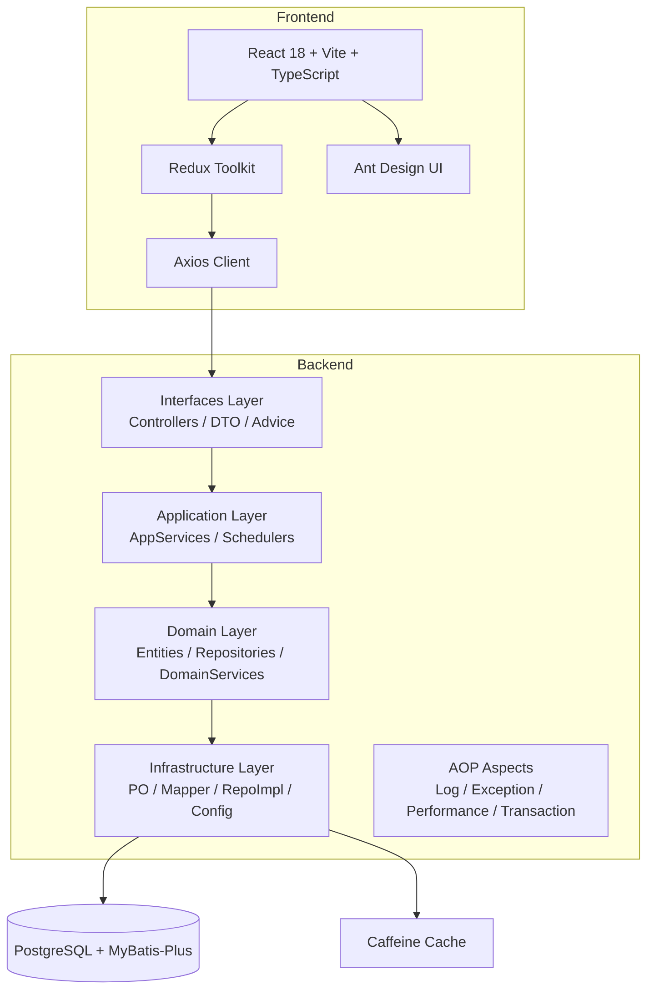
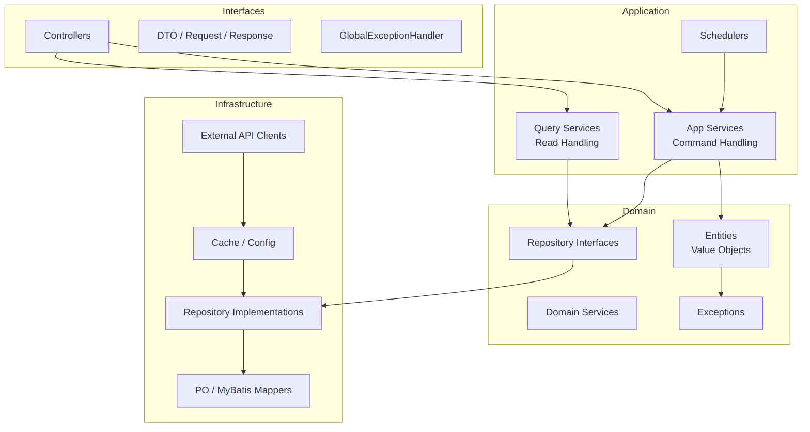
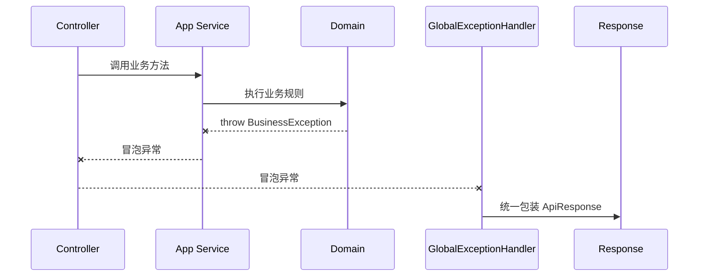
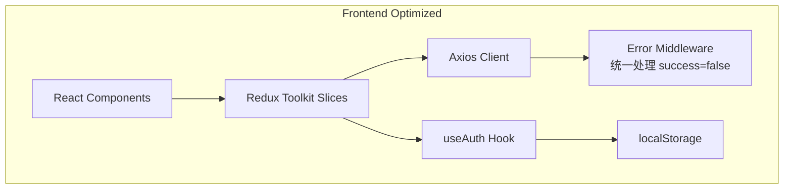

# 股票基金数据采集系统架构优化设计文档

> 版本: v1.0
> 日期: 2026-04-17

---

## 1. 当前架构概览

### 1.1 整体架构



### 1.2 技术栈

| 层级 | 技术 |
|------|------|
| 后端框架 | Spring Boot 3.1.5 + Java 21 |
| 数据访问 | MyBatis-Plus 3.5.3 + PostgreSQL 42.6.0 |
| 缓存 | Caffeine 3.1.8 |
| 消息队列 | Kafka（当前已禁用自动配置） |
| 前端 | React 18 + TypeScript + Vite |
| 状态管理 | Redux Toolkit |
| UI 组件库 | Ant Design |
| 测试 | JUnit 5 + Testcontainers + Playwright E2E |

---

## 2. 架构问题诊断

### 2.1 严重问题（Critical）

| # | 问题 | 影响 | 关键代码位置 |
|---|------|------|-------------|
| 2.1.1 | **Controller 层与全局异常处理器重复处理异常** | 每个 Controller 方法都包裹 `try-catch`，代码极其冗余，且与 `GlobalExceptionHandler` 功能完全重叠 | `SubscriptionController.java:28` 等 |
| 2.1.2 | **领域模型封装被破坏** | `AggregateRoot` 和领域实体使用 `@Data`（Lombok），生成全部 setter，外部可直接修改任何字段，DDD 的封装和不变性荡然无存 | `UserSubscription.java:13`、`DataCollectionTarget.java:11` |
| 2.1.3 | **字段注入（Field Injection）** | 使用 `@Autowired` 字段注入，不利于单元测试和不可变性，违反现代 Spring 最佳实践 | `DataCollectionAppServiceImpl.java:42` 等 |
| 2.1.4 | **异常类定义位置错误** | `BusinessException` 和 `DataCollectionException` 作为内部类定义在 `GlobalExceptionHandler` 中，违反单一职责，且无法被 Domain 层引用 | `GlobalExceptionHandler.java:89` |

### 2.2 中等问题（High）

| # | 问题 | 影响 | 关键代码位置 |
|---|------|------|-------------|
| 2.2.1 | **应用服务过于臃肿** | `DataCollectionAppServiceImpl`（22k+ 字符）混合了 HTTP 调用、数据解析、业务规则、持久化逻辑，违反 SRP | `DataCollectionAppServiceImpl.java:1` |
| 2.2.2 | **CQRS 缺失，读写耦合** | `RiskAlertAppServiceImpl` 在应用服务里做大量数据分组、聚合、去重，这些应属于查询层或视图层逻辑 | `RiskAlertAppServiceImpl.java:114` |
| 2.2.3 | **DTO/PO/Entity 转换散落** | 每个 `RepositoryImpl` 都手写 `toPO()` / `toEntity()`，没有统一的 Assembler/Mapper，新增字段时容易遗漏 | `UserSubscriptionRepositoryImpl.java:142` |
| 2.2.4 | **金融数值类型混用** | `UserSubscription.targetChangePercent` 在 Entity 中用 `Double`，在 PO 中用 `BigDecimal`，来回转换存在精度风险 | `UserSubscription.java:18` vs `UserSubscriptionPO.java:33` |
| 2.2.5 | **AOP 过度设计** | `ExceptionHandlingAspect` 与 `GlobalExceptionHandler` 功能重叠，且 AOP 切面范围过宽，可能掩盖真正的异常堆栈 | `ExceptionHandlingAspect.java:1` |

### 2.3 前端架构问题（Medium）

| # | 问题 | 影响 |
|---|------|------|
| 2.3.1 | **Redux Slice 重复模式** | 每个 slice 都重复写 `if (response.success)` 判断，没有统一的错误处理中间件 |
| 2.3.2 | **认证信息硬编码在 localStorage** | `userId` 和 `token` 直接从 `localStorage` 读取，散落在各 slice 中，没有 Auth Context |
| 2.3.3 | **API 类型与后端不一致** | 前端 `Subscription` 接口定义了 `alertType`/`targetPrice` 等字段，但后端实际存储结构是 `UserSubscription`，字段不完全对齐 |

---

## 3. 架构优化目标

1. **统一异常处理**：Controller 不再手写 `try-catch`，由全局异常处理器统一接管
2. **修复领域模型封装**：移除 `@Data`，使用 `@Getter` + 显式业务方法，保护不变性
3. **构造函数注入**：所有依赖注入改为构造函数注入，提升可测试性
4. **独立异常体系**：异常类下沉到 Domain 层，支持跨层引用
5. **拆分臃肿服务**：将数据采集服务按职责拆分，外部调用抽象到基础设施层
6. **引入 CQRS 查询层**：复杂聚合查询下沉到独立 QueryService，读操作不走完整 DDD 链路
7. **引入 MapStruct**：统一 DTO/PO/Entity 映射，减少手写转换代码
8. **统一金融数值类型**：所有金额、净值、涨跌幅统一使用 `BigDecimal`
9. **精简 AOP**：移除与全局异常处理器重叠的 `ExceptionHandlingAspect`
10. **前端状态管理优化**：统一错误处理中间件 + Auth Hook

---

## 4. 优化后目标架构

### 4.1 后端分层架构



### 4.2 异常处理流程



### 4.3 前端架构优化



---

## 5. 详细优化方案

### 5.1 Controller 层瘦身 — 移除所有手动 try-catch

**当前问题**：
```java
@PostMapping
public ApiResponse<CreateSubscriptionResponse> createSubscription(@RequestBody CreateSubscriptionRequest request) {
    try {
        CreateSubscriptionResponse response = subscriptionAppService.createSubscription(request);
        return ApiResponse.success(response.getMessage(), response);
    } catch (Exception e) {
        return ApiResponse.error("创建订阅失败: " + e.getMessage());
    }
}
```

**优化后**：
```java
@PostMapping
public CreateSubscriptionResponse createSubscription(@RequestBody @Valid CreateSubscriptionRequest request) {
    return subscriptionAppService.createSubscription(request);
}
```

- 删除 Controller 中的 `try-catch` 块
- 由 `GlobalExceptionHandler` 统一捕获并包装为 `ApiResponse`
- Controller 直接返回业务 DTO，降低与响应格式的耦合

### 5.2 修复领域模型封装 — 替换 `@Data`

**当前问题**：`@Data` 生成全部 getter/setter，外部可直接修改内部状态。

**优化后原则**：
- `AggregateRoot` 及所有领域实体移除 `@Data`
- 使用 `@Getter` 暴露只读访问
- 状态变更通过显式业务方法控制（如 `activate()`、`deactivate()`）
- 初始化通过构造函数或 Builder 完成

```java
public class UserSubscription extends AggregateRoot<Long> {
    @Getter
    private Long userId;
    @Getter
    private String symbol;
    @Getter
    private Boolean isActive;

    public void activate() {
        this.isActive = true;
        this.updatedAt = LocalDateTime.now();
    }

    public void deactivate() {
        this.isActive = false;
        this.updatedAt = LocalDateTime.now();
    }
}
```

### 5.3 统一构造函数注入

**当前问题**：大量使用 `@Autowired` 字段注入。

**优化后**：
```java
@Service
@RequiredArgsConstructor
public class SubscriptionAppServiceImpl implements SubscriptionAppService {
    private final UserSubscriptionRepository userSubscriptionRepository;
    private final DataCollectionTargetRepository dataCollectionTargetRepository;
}
```

- 所有 `@Autowired` 字段注入替换为 `final` 字段 + 构造函数注入
- 使用 Lombok `@RequiredArgsConstructor` 减少样板代码

### 5.4 异常体系重构

**当前问题**：异常类定义在 `GlobalExceptionHandler` 内部类中。

**优化后目录结构**：
```
domain/exception/
├── BusinessException.java
├── DataCollectionException.java
├── SubscriptionNotFoundException.java
└── ErrorCode.java          // 错误码枚举
```

- `GlobalExceptionHandler` 只负责 **映射异常到 HTTP 响应**
- Domain 层可直接抛出 `BusinessException`，支持真正的 DDD 分层

### 5.5 引入 CQRS 查询层

**当前问题**：`RiskAlertAppServiceImpl.getRiskAlertsByDateRange()` 在应用服务里做大量数据分组、聚合、去重。

**优化后**：
- 新建 `application/query/RiskAlertQueryService.java`
- 复杂查询直接返回扁平化 DTO，不经过完整的 Domain Entity 转换
- 读操作与写操作分离，提升性能和可维护性

```java
@Service
@RequiredArgsConstructor
public class RiskAlertQueryService {
    private final RiskAlertMapper riskAlertMapper;

    public List<RiskAlertSummaryDTO> getRiskAlertsByDateRange(Long userId, LocalDate startDate, LocalDate endDate) {
        // 直接查询聚合结果，或在数据库层完成分组
        return riskAlertMapper.findSummaryByDateRange(userId, startDate, endDate);
    }
}
```

### 5.6 引入 MapStruct 自动化映射

**当前问题**：每个 `RepositoryImpl` 手写 `toPO()` / `toEntity()`，重复且易遗漏。

**优化方案**：
- 在 `pom.xml` 中添加 `mapstruct` 和 `mapstruct-processor`
- 定义独立的 Mapper 接口

```java
@Mapper(componentModel = "spring")
public interface UserSubscriptionMapperStruct {
    UserSubscriptionPO toPO(UserSubscription entity);
    UserSubscription toEntity(UserSubscriptionPO po);
    List<UserSubscription> toEntityList(List<UserSubscriptionPO> pos);
}
```

### 5.7 拆分臃肿应用服务

**当前问题**：`DataCollectionAppServiceImpl`（22k+ 字符）职责过多。

**优化后拆分**：
```
application/service/datacollection/
├── StockDataCollectionService.java
├── FundDataCollectionService.java
└── DataProcessingAppService.java

infrastructure/client/
├── TushareApiClient.java
└── ExternalDataClient.java
```

- HTTP 调用、数据解析逻辑下沉到 `infrastructure/client/`
- Application Service 只负责编排和调度

### 5.8 统一金融数值类型为 BigDecimal

**优化原则**：
- 所有涉及金额、净值、涨跌幅的字段统一使用 `BigDecimal`
- 遵循项目编码规范：`NAV` 4 位小数，`Percentage` / `Price` / `Amount` 2 位小数
- 禁止使用 `Double` 存储金融数据

### 5.9 AOP 精简

**优化措施**：
- **移除** `ExceptionHandlingAspect.java`：其职责已由 `GlobalExceptionHandler` 覆盖，且会掩盖真实异常堆栈
- 保留 `LoggingAspect` 和 `PerformanceMonitoringAspect`，但优化切点表达式
- 避免对高频调用的 Repository 方法应用重量级 AOP

### 5.10 前端状态管理优化

**优化措施**：
- 在 Axios 拦截器中统一处理 `response.success === false`，转换为 Promise.reject
- 提取 `useAuth()` Hook，封装 `userId` / `token` 读取
- 可选：创建 `createApiThunk` 工厂函数，减少 Redux slice 中的重复 boilerplate

---

## 6. 实施计划（分阶段）

为了控制风险，建议按以下优先级分阶段实施：

### Phase 1：异常处理与 Controller 瘦身 ✅
**目标**：统一异常处理，移除 Controller 中的手动 try-catch
**涉及文件**：
- 所有 `*Controller.java`
- `GlobalExceptionHandler.java`
- 新增 `domain/exception/` 包
**实施状态**：
- ✅ `domain/exception/` 包已创建（`BusinessException.java`, `ResourceNotFoundException.java`, `DataCollectionException.java`）
- ✅ `GlobalExceptionHandler.java` 已实现统一异常处理
- ✅ `SubscriptionController.java` 已移除 try-catch
- ✅ `RiskAlertController.java` 已移除 try-catch（含修复：硬编码用户ID改为路径参数）
- ✅ `DashboardController.java` 已移除 try-catch
- ✅ `DataCollectionTargetController.java` 已移除 try-catch

### Phase 2：构造函数注入与 MapStruct 引入 ⏳
**目标**：替换字段注入，引入自动化映射
**涉及文件**：
- 所有 `*ServiceImpl.java`
- 所有 `*RepositoryImpl.java`
- `pom.xml`
- 新增 `infrastructure/mapper/struct/` 包
**实施状态**：
- ⚠️ `pom.xml` 中曾添加 `<mapstruct.version>1.5.5.Final</mapstruct.version>` 但缺少依赖声明，已回滚
- ⏳ 待完成：引入 MapStruct 依赖并配置 annotationProcessorPaths
- ⏳ 待完成：所有 `*ServiceImpl.java` 改为构造函数注入
- ⏳ 待完成：所有 `*RepositoryImpl.java` 改为构造函数注入

### Phase 3：领域模型封装修复 ⏳
**目标**：移除 `@Data`，修复领域模型不变性
**涉及文件**：
- `AggregateRoot.java`
- 所有 `domain/entity/*.java`
**实施状态**：
- ⏳ 待完成

### Phase 4：应用服务拆分与 CQRS 引入 ⏳
**目标**：拆分臃肿服务，复杂查询下沉到 QueryService
**涉及文件**：
- `DataCollectionAppServiceImpl.java`
- `RiskAlertAppServiceImpl.java`
- 新增 `application/query/` 包
- 新增 `infrastructure/client/` 包
**实施状态**：
- ⏳ 待完成

### Phase 5：前端统一错误处理与 Auth 抽象 ⏳
**目标**：优化前端状态管理
**涉及文件**：
- `services/api/client.ts`
- `store/slices/*.ts`
- 新增 `hooks/useAuth.ts`
**实施状态**：
- ⏳ 待完成
- 📝 本次提交包含前端 SubscriptionEdit 组件（新增编辑功能）和 SubscriptionList UI 改进，但尚未实现统一的错误处理中间件

---

## 7. 预期收益

| 维度 | 收益 |
|------|------|
| **可维护性** | Controller 代码量减少 40%+，异常处理逻辑统一在一处 |
| **可测试性** | 构造函数注入使所有 Service 无需 Spring 容器即可单元测试 |
| **正确性** | 领域模型封装修复后，状态变更只能通过显式业务方法，减少非法状态 |
| **开发效率** | MapStruct 消除手写转换代码，新增字段时自动同步 |
| **性能** | CQRS 查询层避免 Domain Entity 全量转换，读操作性能提升 |
| **安全性** | 金融数值统一使用 `BigDecimal`，杜绝 `Double` 精度问题 |

---

## 8. 风险与应对

| 风险 | 应对措施 |
|------|---------|
| MapStruct 编译期代码生成增加构建复杂度 | 在 `pom.xml` 中正确配置 `annotationProcessorPaths`，与 `lombok` 处理器顺序保持一致 |
| 领域实体移除 `@Data` 后现有代码大量报错 | 分模块逐步迁移，先修复核心实体（`UserSubscription`、`RiskAlert`、`DataCollectionTarget`） |
| Controller 瘦身可能导致前端接口响应格式变化 | 由 `GlobalExceptionHandler` 统一包装 `ApiResponse`，确保前端无感知 |
| CQRS 引入初期查询逻辑分散 | 建立规范：所有复杂聚合查询必须通过 `*QueryService`，简单 CRUD 保留在 AppService |

---

## 9. 下一步行动

1. 评审并确认本设计文档
2. 确定 Phase 1 的实施优先级和负责人
3. 切换到 **Code 模式** 开始按 Phase 1 逐步落地
