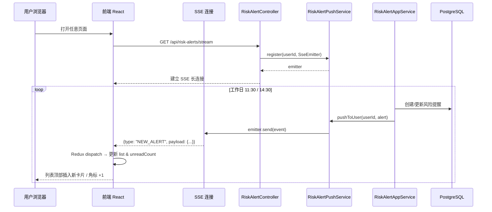

# 实时风险提醒推送需求文档（PRD）

## 1. 背景与问题

当前系统的风险提醒数据仅在**工作日 11:30 和 14:30** 由后端定时任务生成，但前端页面和导航栏未读角标只在**用户手动刷新或重新打开页面时**才能获取到最新数据。这导致：

- 用户在系统停留期间，无法感知新产生的风险提醒。
- 导航栏铃铛数字滞后，用户可能错过重要风险通知。
- 用户必须手动刷新风险提醒列表页面才能看到新数据。

## 2. 目标

实现风险提醒的**准实时推送**，在后台生成新的风险提醒后，前端能够在**数秒内**自动更新：

1. 导航栏未读角标自动 `+N`。
2. 若用户当前停留在风险提醒列表页，新数据自动插入列表顶部。
3. 保持现有分页、已读/未读等业务逻辑不变。

## 3. 技术方案选型

### 3.1 方案对比

| 方案 | 实时性 | 复杂度 | 资源消耗 | 适用性 |
|------|--------|--------|----------|--------|
| 短轮询（Polling） | 低（依赖间隔） | 低 | 高（无效请求多） | ❌ 不推荐 |
| 长轮询（Long Polling） | 中 | 中 | 较高 | ❌ 不推荐 |
| **SSE（Server-Sent Events）** | **高** | **低** | **低** | **✅ 推荐** |
| WebSocket | 高 | 高 | 低 | ⚠️ 过度设计 |

### 3.2 推荐方案：SSE（Server-Sent Events）

**理由**：

- **单向推送**：风险提醒是典型的服务器→客户端单向场景，SSE 天然匹配。
- **协议简单**：基于 HTTP，Spring Boot 原生支持 `SseEmitter`，前端原生支持 `EventSource`。
- **自动重连**：浏览器 `EventSource` 在连接断开后会自动重连，无需额外编码。
- **零新增依赖**：项目已有 `spring-boot-starter-web`，无需引入 WebSocket 或消息队列客户端。
- **穿透性好**：基于标准 HTTP，易于穿过防火墙和反向代理（Nginx 等）。

### 3.3 多端多标签页推送设计

同一用户可能在**多个浏览器标签页**或**多个设备**同时打开系统，推送需满足：

- **每个标签页独立接收**：用户打开 3 个标签页，3 个标签页的角标同时更新。
- **每个设备独立接收**：用户同时在电脑和手机登录，两端同时收到推送。
- **已读状态多端同步**：用户在 A 标签页点击"全部已读"，B 标签页和手机的角标立即清零。

**后端连接模型**：

```
Map<Long, List<SseEmitter>> userEmitters

例：
userId=1 → [Emitter-tab-1, Emitter-tab-2, Emitter-phone-1]
userId=2 → [Emitter-tab-3]
```

推送时按 `userId` 广播，遍历该用户的所有活跃连接逐一发送。单个连接失败（如标签页已关闭）不影响其他连接。

### 3.4 扩展预留

当前按**单机内存管理 SseEmitter**实现，但接口层预留**多实例广播**扩展能力：

```
阶段 1（当前）：单机内存推送
  RiskAlertPushService 使用 ConcurrentHashMap<Long, CopyOnWriteArrayList<SseEmitter>> 管理用户连接。

阶段 2（未来多实例）：引入 Kafka 广播
  - RiskAlertAppService 创建风险提醒后，发送 Kafka Topic `risk-alert-created`。
  - 各实例的 Consumer 接收消息，调用本地 RiskAlertPushService 推送给本实例持有的连接。
```

## 4. 业务规则

### 4.1 触发推送的时机

#### 逐条推送（创建或更新风险提醒时）

在 `RiskAlertAppServiceImpl.createOrUpdateRiskAlert()` 方法中，每次成功保存或更新记录后，立即触发 SSE 推送。具体规则：

| 操作类型 | `new_alert` 事件 | `unread_count_change` 事件 | 说明 |
|---|---|---|---|
| **新建记录** | ✅ 推送完整提醒数据 | ✅ `unreadCount` +1 | 首次触发该标的 |
| **更新已有记录** | ❌ 不推送 | ✅ `unreadCount` 根据数据库重新计算后推送 | 14:30 覆盖 11:30 的同标的记录，`isRead` 重置为 `false`，未读计数变化 |

**触发来源**：

- `RiskAlertScheduler` 在 11:30 / 14:30 执行 `checkAndCreateRiskAlerts()` 时，遍历所有订阅逐条处理。
- 管理员/测试人员手动调用 `POST /api/risk-alerts/check` 时。
- 后续可能扩展的批量创建接口。

#### 已读状态多端同步

- 用户在任意标签页/设备调用 `POST /api/risk-alerts/user/{userId}/mark-read` 标记全部已读后：
  - 数据库状态更新。
  - 后端通过 SSE 向该用户的**所有活跃连接**广播 `unread_count_change` 事件（`unreadCount: 0`）。
  - 所有打开的标签页/设备角标同步清零，无需刷新。

**不推送 `new_alert` 的场景**：

- 已有风险提醒被更新（如 14:30 覆盖了 11:30 的同标的记录）—— 此时 `isRead` 重置为 `false`，未读计数可能变化，因此**仍推送 `unread_count_change`**，但**不推送 `new_alert`**（列表中该条目已存在，前端通过收到 `unread_count_change` 后自行刷新列表即可）。

### 4.2 推送内容

每次推送包含：

- `type`: `NEW_ALERT`（新提醒）或 `UNREAD_COUNT_CHANGE`（未读数变化）
- `payload`: 完整的风险提醒摘要对象或未读数量
- `timestamp`: 推送时间戳

### 4.3 前端行为

| 用户所在页面 | 收到推送后的行为 |
|-------------|----------------|
| **风险提醒列表页** | 新提醒数据 `prepend` 到列表顶部；若列表为空则替换 Empty 状态；未读角标 `+1`。 |
| **其他页面** | 仅导航栏未读角标 `+1`；不主动跳转。 |
| **页面处于后台（hidden）** | 角标更新；页面切回前台时，若在当前页可触发一次静默刷新。 |

## 5. 系统架构

### 5.1 整体流程



### 5.2 后端组件

```
backend/
├── application/service/riskalert/
│   ├── RiskAlertAppService.java              ← 现有：创建风险提醒后发布事件
│   └── impl/RiskAlertAppServiceImpl.java     ← 修改：createOrUpdate 后发送事件
├── application/service/riskalert/push/
│   ├── RiskAlertPushService.java             ← 新增：推送服务接口
│   └── impl/InMemoryRiskAlertPushService.java ← 新增：单机内存实现
├── application/event/
│   └── RiskAlertCreatedEvent.java            ← 新增：Spring 应用事件
├── interfaces/controller/riskalert/
│   └── RiskAlertSSEController.java           ← 新增：SSE 端点
└── config/
    └── SSEConfig.java                        ← 新增：超时、心跳配置
```

### 5.3 前端组件

```
app/
├── services/
│   └── sse/
│       └── riskAlertSSE.ts                  ← 新增：EventSource 封装
├── store/slices/
│   └── riskAlertsSlice.ts                   ← 修改：新增实时接收 reducer
├── hooks/
│   └── useRiskAlertSSE.ts                   ← 新增：SSE 连接生命周期 Hook
└── components/layout/
    └── Header.tsx                             ← 修改：角标自动响应
```

## 6. 非功能需求

### 6.1 性能

- SSE 连接超时：默认 30 分钟（Spring SseEmitter 默认无超时，建议配置）。
- 心跳机制：每 30 秒发送一次 `ping` 事件，防止 Nginx/防火墙切断空闲连接。
- 单用户可维持 **多条** SSE 连接（多标签页/多端），后端使用 `CopyOnWriteArrayList<SseEmitter>` 管理，避免并发修改异常。
- 推送为异步操作，不阻塞风险提醒入库事务。
- 连接清理：SseEmitter 的 `onCompletion` / `onTimeout` / `onError` 回调中自动从用户连接列表移除。

### 6.2 可靠性

- 连接断开时，前端应在 3 秒内自动重连（EventSource 原生支持）。
- 后端维护连接时考虑异常隔离：单个用户推送失败不影响其他用户。
- 若推送失败（用户已离线），数据仍保留在数据库中，用户下次刷新页面可正常获取。

### 6.3 安全

- SSE 端点需校验用户身份（当前使用 `localStorage` 中的 `userId`，后续接入 JWT 时应从 Token 解析）。
- 用户只能订阅属于自己的推送流（按 `userId` 隔离）。
- 需配置 CORS，仅允许同源或指定域名访问 SSE 端点。

## 7. 兼容性影响

| 范围 | 影响 | 处理方案 |
|------|------|----------|
| 现有 REST API | 无影响 | 完全兼容，仅新增 SSE 端点 |
| 数据库表结构 | 无影响 | 不修改表结构 |
| 前端 Redux Store | 小影响 | `riskAlertsSlice` 新增 reducer 处理实时数据 |
| 依赖 | 无新增 | 利用现有 `spring-boot-starter-web` |
| 多实例部署 | 预留扩展 | 阶段 2 引入 Kafka 广播 |

## 8. 验收标准（AC）

### 8.1 基础连接

| 编号 | 验收标准 | 优先级 | 测试方式 |
|------|----------|--------|----------|
| **AC-1** | 用户打开页面后，浏览器 Network 面板可见 `/api/risk-alerts/stream` 请求，Response Headers 包含 `Content-Type: text/event-stream`，状态持续为 `200 pending`。 | P0 | 手工 + E2E |
| **AC-1-1** | SSE 建立后，服务端在 1 秒内推送 `init` 事件，前端 `unreadCount` 与数据库当前未读数一致。 | P0 | E2E |
| **AC-1-2** | 服务端每 30 秒发送一次 `ping` 事件，浏览器持续接收且无超时断开。 | P1 | 手工观察 |

### 8.2 数据推送（新风险提醒）

| 编号 | 验收标准 | 优先级 | 测试方式 |
|------|----------|--------|----------|
| **AC-2** | 手动触发风险检测（`POST /api/risk-alerts/check`）后，导航栏铃铛数字在 **3 秒内**自动增加。 | P0 | E2E |
| **AC-2-1** | 工作日 11:30 / 14:30 定时任务触发风险检测后，已登录用户无需任何操作，角标在 **10 秒内**自动增加。 | P0 | 手工（需等待定时任务）或 mock 时间 |
| **AC-3** | 用户停留在风险提醒列表页时，新产生的风险提醒自动出现在列表**最顶部**，且列表原有数据顺序不变。 | P0 | E2E |
| **AC-3-1** | 同一标的在同一日多次触发（如 11:30 和 14:30），列表中**不重复插入**，而是更新现有条目（时间、涨跌幅、触发次数）。 | P1 | E2E |
| **AC-3-2** | 新推送提醒的 `isRead` 初始为 `false`，列表中该卡片有"未读"视觉标识（如红点或背景色）。 | P1 | E2E |

### 8.3 多端/多标签页同步

| 编号 | 验收标准 | 优先级 | 测试方式 |
|------|----------|--------|----------|
| **AC-5** | 同一用户打开 3 个标签页，触发风险检测后，3 个标签页的铃铛数字均在 **3 秒内**同步增加。 | P0 | E2E |
| **AC-5-1** | 用户在标签页 A 点击"全部已读"后，标签页 B 和标签页 C 的铃铛数字在 **3 秒内**同步清零，且列表中所有卡片的未读标识消失。 | P0 | E2E |
| **AC-5-2** | 用户在标签页 A 删除某条风险提醒后，标签页 B 的列表中该条提醒同步消失。 | P1 | E2E |

### 8.4 稳定性与可靠性

| 编号 | 验收标准 | 优先级 | 测试方式 |
|------|----------|--------|----------|
| **AC-4** | 前端网络断开（如关闭 WiFi）5 秒后恢复，EventSource 在 **5 秒内**自动重连并继续接收后续推送。 | P0 | 手工 |
| **AC-4-1** | 后端服务重启后，前端在 **10 秒内**自动重连成功，并收到新的 `init` 事件。 | P1 | 手工 |
| **AC-6** | 非交易时段无风险提醒产生时，SSE 连接保持至少 30 分钟不被中间件（Nginx/防火墙）切断。 | P1 | 手工观察 |
| **AC-6-1** | 单个用户连接异常（如强制关闭浏览器）后，后端在 **2 分钟内**完成连接清理，该用户连接数正确减少。 | P1 | 日志 + JMX/监控 |
| **AC-6-2** | 向用户 A 推送失败（如连接已死），不影响用户 B 的正常推送，系统无异常报错。 | P1 | 单元测试 |

### 8.5 连接数控制与边界

| 编号 | 验收标准 | 优先级 | 测试方式 |
|------|----------|--------|----------|
| **AC-7** | 同一用户打开第 4 个标签页时，最早建立的 SSE 连接被服务端强制关闭，该标签页收到 `onerror` 后按重连策略处理；同时后端该用户连接数始终不超过 **3**。 | P1 | E2E + 后端日志 |
| **AC-7-1** | 用户未携带 `userId` 请求 `/api/risk-alerts/stream`，服务端返回 `400 Bad Request`，不建立连接。 | P1 | 单元测试 |
| **AC-7-2** | 用户 A 请求 `/api/risk-alerts/stream?userId=2`（冒用他人 ID），服务端返回 `401 Unauthorized`。 | P1 | 单元测试 |

### 8.6 性能与资源

| 编号 | 验收标准 | 优先级 | 测试方式 |
|------|----------|--------|----------|
| **AC-8** | 50 个用户同时保持 SSE 连接，系统内存增长不超过 **50MB**，CPU 无明显抖动。 | P2 | 压测 |
| **AC-8-1** | 风险提醒入库与 SSE 推送**异步执行**，入库响应时间不因推送而增加（延迟 < 50ms）。 | P2 | 性能测试 |

---

> **优先级说明**：
> - **P0**：核心功能，必须验收通过才能上线
> - **P1**：重要功能，建议验收通过
> - **P2**：优化/防护项，可后续迭代补充
